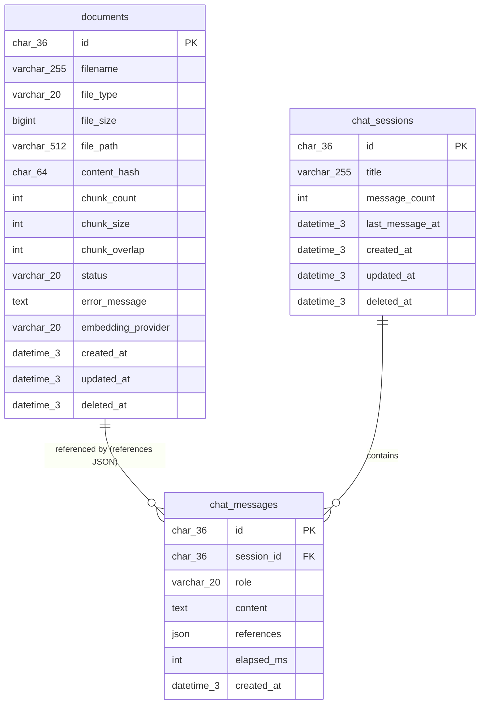
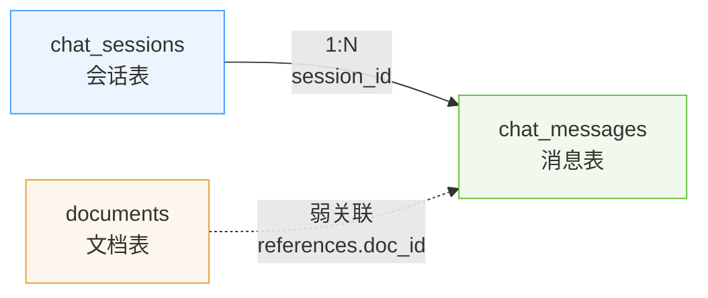

<!--
Document: Database Schema
Version: 1.0.0
Author: Database Engineer
Created: 2026-07-12
Updated: 2026-07-12
Status: Completed
-->

# Database Schema: AI 文档知识库（MVP）

## 文档元信息

| 字段 | 内容 |
|------|------|
| 文档名称 | 数据库 Schema 文档 |
| 项目名称 | AI 文档知识库（MVP） |
| 版本 | 1.0.0 |
| 作者 | Database Engineer |
| 创建日期 | 2026-07-12 |
| 状态 | Completed |
| 关联文档 | `docs/prd.md`、`docs/architecture.md`、`docs/decision-log.md` |

---

## 1. 概述

### 1.1 基本信息

| 属性 | 值 |
|------|------|
| 数据库系统 | MariaDB 10.5+ |
| 数据库名称 | ai_knowledge_base |
| 字符集 | utf8mb4 |
| 排序规则 | utf8mb4_unicode_ci |
| 时区 | UTC（应用层处理时区转换） |
| 存储引擎 | InnoDB |
| 主键策略 | UUID（CHAR(36)，应用层用 Python `uuid.uuid4()` 生成） |
| 软删除策略 | `deleted_at` 字段，NULL 表示未删除 |
| 向量数据库 | Chroma（嵌入式持久化，`./data/chroma`） |

### 1.2 设计依据

| 依据 | 来源 |
|------|------|
| 数据存储分配 | 架构文档 8.3 节 |
| API 响应字段要求 | 架构文档第 9 章 |
| 禁用 Docker 约束 | DEC-005 |
| Embedding Provider 抽象 | DEC-008、DEC-012 |
| 多轮上下文截断 | DEC-011（最近 4 轮 = 8 条消息） |
| 递归字符切分 | DEC-016（chunk_size=500, overlap=50） |
| Chroma 持久化目录 | DEC-007（`./data/chroma`） |

### 1.3 MariaDB 与 PostgreSQL 适配说明

本项目使用 MariaDB 而非 PostgreSQL，以下为关键语法适配：

| 特性 | PostgreSQL | MariaDB 适配 |
|------|------------|--------------|
| 主键 UUID 生成 | `DEFAULT gen_random_uuid()` | 应用层生成 `uuid.uuid4()`，MariaDB 仅存储 |
| 时间类型 | `TIMESTAMPTZ` | `DATETIME(3)`（毫秒精度，UTC） |
| JSON 类型 | `JSONB` | `JSON`（MariaDB 10.2.7+） |
| 部分索引 | `WHERE deleted_at IS NULL` | 不支持，改用普通索引；查询时显式过滤 |
| 注释语法 | `COMMENT ON COLUMN tbl.col IS '...'` | 行内 `COMMENT '...'` |
| 布尔类型 | `BOOLEAN` | `TINYINT(1)`（MariaDB 无原生 BOOLEAN） |
| 自增 | `BIGSERIAL` | `BIGINT AUTO_INCREMENT`（本项目用 UUID，不使用） |

### 1.4 ER 图



**关系说明**：
- `chat_sessions` 与 `chat_messages` 为 1:N 关系（一个会话包含多条消息）
- `documents` 与 `chat_messages` 为弱关联关系（通过 `chat_messages.references` JSON 中的 `doc_id` 引用，非外键约束，因为引用来源是动态检索结果）

---

## 2. MariaDB 表定义

### 2.1 表: documents

#### 2.1.1 表描述

存储上传文档的元数据信息，包括文件名、类型、大小、切片数量、处理状态等。文档上传后由 DocumentService 解析、切分、向量化，状态从 `pending` 流转为 `processing` → `completed`（或 `failed`）。删除文档时软删除此表记录，后端业务层同步清理 Chroma 向量与文件系统原文件。

#### 2.1.2 列定义

| 列名 | 类型 | 约束 | 默认值 | 说明 |
|------|------|------|--------|------|
| id | CHAR(36) | PK, NOT NULL | 应用层生成 | 文档唯一标识符（UUID） |
| filename | VARCHAR(255) | NOT NULL | - | 原始文件名（含扩展名） |
| file_type | VARCHAR(20) | NOT NULL | - | 文件类型：pdf / docx / md / txt |
| file_size | BIGINT | NOT NULL | - | 文件大小（字节） |
| file_path | VARCHAR(512) | NOT NULL | - | 存储路径（相对路径，如 `uploads/2026/07/uuid.pdf`） |
| content_hash | CHAR(64) | NULL | NULL | 文件内容 SHA-256 哈希（用于去重检测） |
| chunk_count | INT | NOT NULL | 0 | 文本切片数量 |
| chunk_size | INT | NOT NULL | 500 | 切片大小（字符数，DEC-016） |
| chunk_overlap | INT | NOT NULL | 50 | 切片重叠（字符数，DEC-016） |
| status | VARCHAR(20) | NOT NULL | 'pending' | 处理状态：pending / processing / completed / failed |
| error_message | TEXT | NULL | NULL | 错误信息（status=failed 时记录） |
| embedding_provider | VARCHAR(20) | NULL | NULL | 使用的 Embedding Provider：openai / bge（记录向量化时所用 Provider） |
| created_at | DATETIME(3) | NOT NULL | CURRENT_TIMESTAMP(3) | 创建时间（UTC） |
| updated_at | DATETIME(3) | NOT NULL | CURRENT_TIMESTAMP(3) ON UPDATE CURRENT_TIMESTAMP(3) | 更新时间（UTC） |
| deleted_at | DATETIME(3) | NULL | NULL | 软删除时间，NULL 表示未删除 |

#### 2.1.3 索引

| 索引名 | 列 | 类型 | 说明 |
|--------|------|------|------|
| PRIMARY | id | PRIMARY KEY | 主键索引 |
| idx_documents_status | status | BTREE | 按状态过滤文档列表（completed 文档可被检索） |
| idx_documents_created_at | created_at | BTREE | 按创建时间排序（文档列表默认按时间倒序） |
| idx_documents_content_hash | content_hash | BTREE | 去重检测（按内容哈希查询） |
| idx_documents_embedding_provider | embedding_provider | BTREE | 按 Provider 过滤（切换 Provider 时查找需重新向量化的文档） |

#### 2.1.4 约束

| 约束名 | 类型 | 定义 | 说明 |
|--------|------|------|------|
| PRIMARY | PRIMARY KEY | (id) | 主键 |
| ck_documents_file_type | CHECK | file_type IN ('pdf', 'docx', 'md', 'txt') | 文件类型枚举 |
| ck_documents_status | CHECK | status IN ('pending', 'processing', 'completed', 'failed') | 状态枚举 |
| ck_documents_file_size | CHECK | file_size > 0 AND file_size <= 20971520 | 文件大小限制（>0 且 ≤ 20MB，DEC-006） |

> **注意**：MariaDB 10.2.1+ 支持 CHECK 约束语法，但实际约束执行依赖版本。应用层须做等效校验。

#### 2.1.5 DDL

```sql
-- ============================================
-- Table: documents
-- Description: 文档元数据表，存储上传文档的信息
-- ============================================
CREATE TABLE IF NOT EXISTS documents (
    id                  CHAR(36)        NOT NULL                                    COMMENT '文档唯一标识符（UUID）',
    filename            VARCHAR(255)    NOT NULL                                    COMMENT '原始文件名（含扩展名）',
    file_type           VARCHAR(20)     NOT NULL                                    COMMENT '文件类型：pdf/docx/md/txt',
    file_size           BIGINT          NOT NULL                                    COMMENT '文件大小（字节）',
    file_path           VARCHAR(512)    NOT NULL                                    COMMENT '存储路径（相对路径）',
    content_hash        CHAR(64)        DEFAULT NULL                                COMMENT '文件内容 SHA-256 哈希（去重检测）',
    chunk_count         INT             NOT NULL DEFAULT 0                          COMMENT '文本切片数量',
    chunk_size          INT             NOT NULL DEFAULT 500                        COMMENT '切片大小（字符数）',
    chunk_overlap       INT             NOT NULL DEFAULT 50                         COMMENT '切片重叠（字符数）',
    status              VARCHAR(20)     NOT NULL DEFAULT 'pending'                  COMMENT '处理状态：pending/processing/completed/failed',
    error_message       TEXT            DEFAULT NULL                                COMMENT '错误信息（status=failed 时）',
    embedding_provider  VARCHAR(20)     DEFAULT NULL                                COMMENT '使用的 Embedding Provider：openai/bge',
    created_at          DATETIME(3)     NOT NULL DEFAULT CURRENT_TIMESTAMP(3)       COMMENT '创建时间（UTC）',
    updated_at          DATETIME(3)     NOT NULL DEFAULT CURRENT_TIMESTAMP(3) ON UPDATE CURRENT_TIMESTAMP(3) COMMENT '更新时间（UTC）',
    deleted_at          DATETIME(3)     DEFAULT NULL                                COMMENT '软删除时间，NULL 表示未删除',

    PRIMARY KEY (id),
    INDEX idx_documents_status (status),
    INDEX idx_documents_created_at (created_at),
    INDEX idx_documents_content_hash (content_hash),
    INDEX idx_documents_embedding_provider (embedding_provider),

    CONSTRAINT ck_documents_file_type CHECK (file_type IN ('pdf', 'docx', 'md', 'txt')),
    CONSTRAINT ck_documents_status CHECK (status IN ('pending', 'processing', 'completed', 'failed')),
    CONSTRAINT ck_documents_file_size CHECK (file_size > 0 AND file_size <= 20971520)
) ENGINE=InnoDB DEFAULT CHARSET=utf8mb4 COLLATE=utf8mb4_unicode_ci COMMENT='文档元数据表';
```

---

### 2.2 表: chat_sessions

#### 2.2.1 表描述

存储聊天会话信息。每个会话包含标题、消息数量、最后消息时间等。用户新建会话后可在其中进行多轮问答。删除会话时软删除此表记录，后端业务层同步物理删除关联的 chat_messages 记录（消息不保留）。

#### 2.2.2 列定义

| 列名 | 类型 | 约束 | 默认值 | 说明 |
|------|------|------|--------|------|
| id | CHAR(36) | PK, NOT NULL | 应用层生成 | 会话唯一标识符（UUID） |
| title | VARCHAR(255) | NOT NULL | '新会话' | 会话标题（默认"新会话"，可根据首条问题自动生成） |
| message_count | INT | NOT NULL | 0 | 消息数量（含 user 与 assistant） |
| last_message_at | DATETIME(3) | NULL | NULL | 最后一条消息时间（用于会话列表排序） |
| created_at | DATETIME(3) | NOT NULL | CURRENT_TIMESTAMP(3) | 创建时间（UTC） |
| updated_at | DATETIME(3) | NOT NULL | CURRENT_TIMESTAMP(3) ON UPDATE CURRENT_TIMESTAMP(3) | 更新时间（UTC） |
| deleted_at | DATETIME(3) | NULL | NULL | 软删除时间，NULL 表示未删除 |

#### 2.2.3 索引

| 索引名 | 列 | 类型 | 说明 |
|--------|------|------|------|
| PRIMARY | id | PRIMARY KEY | 主键索引 |
| idx_chat_sessions_last_message_at | last_message_at | BTREE | 按最后消息时间排序（会话列表默认按最近活跃排序） |
| idx_chat_sessions_created_at | created_at | BTREE | 按创建时间排序 |

#### 2.2.4 约束

| 约束名 | 类型 | 定义 | 说明 |
|--------|------|------|------|
| PRIMARY | PRIMARY KEY | (id) | 主键 |
| ck_chat_sessions_message_count | CHECK | message_count >= 0 | 消息数量非负 |

#### 2.2.5 DDL

```sql
-- ============================================
-- Table: chat_sessions
-- Description: 聊天会话表，存储会话信息
-- ============================================
CREATE TABLE IF NOT EXISTS chat_sessions (
    id                  CHAR(36)        NOT NULL                                    COMMENT '会话唯一标识符（UUID）',
    title               VARCHAR(255)    NOT NULL DEFAULT '新会话'                   COMMENT '会话标题',
    message_count       INT             NOT NULL DEFAULT 0                          COMMENT '消息数量（含 user 与 assistant）',
    last_message_at     DATETIME(3)     DEFAULT NULL                                COMMENT '最后一条消息时间',
    created_at          DATETIME(3)     NOT NULL DEFAULT CURRENT_TIMESTAMP(3)       COMMENT '创建时间（UTC）',
    updated_at          DATETIME(3)     NOT NULL DEFAULT CURRENT_TIMESTAMP(3) ON UPDATE CURRENT_TIMESTAMP(3) COMMENT '更新时间（UTC）',
    deleted_at          DATETIME(3)     DEFAULT NULL                                COMMENT '软删除时间，NULL 表示未删除',

    PRIMARY KEY (id),
    INDEX idx_chat_sessions_last_message_at (last_message_at),
    INDEX idx_chat_sessions_created_at (created_at),

    CONSTRAINT ck_chat_sessions_message_count CHECK (message_count >= 0)
) ENGINE=InnoDB DEFAULT CHARSET=utf8mb4 COLLATE=utf8mb4_unicode_ci COMMENT='聊天会话表';
```

---

### 2.3 表: chat_messages

#### 2.3.1 表描述

存储会话中的每条消息（用户提问与 AI 回答）。user 消息包含 content；assistant 消息额外包含 references（引用来源 JSON）与 elapsed_ms（流式生成耗时）。多轮上下文查询通过 (session_id, created_at) 复合索引快速获取最近 N 条消息（DEC-011：最近 4 轮 = 8 条消息）。

**注意**：此表不使用软删除。删除会话时由业务层物理删除该会话的所有消息（`DELETE FROM chat_messages WHERE session_id = ?`），因为消息无独立保留价值，且软删除会增加上下文查询复杂度。

#### 2.3.2 列定义

| 列名 | 类型 | 约束 | 默认值 | 说明 |
|------|------|------|--------|------|
| id | CHAR(36) | PK, NOT NULL | 应用层生成 | 消息唯一标识符（UUID） |
| session_id | CHAR(36) | FK, NOT NULL | - | 会话 ID，关联 chat_sessions.id |
| role | VARCHAR(20) | NOT NULL | - | 消息角色：user / assistant |
| content | MEDIUMTEXT | NOT NULL | - | 消息内容（user 为问题，assistant 为回答） |
| references | JSON | NULL | NULL | 引用来源（仅 assistant，JSON 数组，结构见 2.3.6） |
| elapsed_ms | INT | NULL | NULL | 流式生成耗时（毫秒，仅 assistant） |
| created_at | DATETIME(3) | NOT NULL | CURRENT_TIMESTAMP(3) | 创建时间（UTC） |

#### 2.3.3 索引

| 索引名 | 列 | 类型 | 说明 |
|--------|------|------|------|
| PRIMARY | id | PRIMARY KEY | 主键索引 |
| idx_chat_messages_session_created | (session_id, created_at) | BTREE | **核心索引**：按会话查询消息并按时间排序，支撑多轮上下文查询（DEC-011）与会话消息列表 |
| idx_chat_messages_session_id | session_id | BTREE | 按会话删除消息（外键索引） |

> **索引设计说明**：`idx_chat_messages_session_created` 为复合索引，满足两种查询场景：
> 1. 多轮上下文查询：`WHERE session_id = ? ORDER BY created_at DESC LIMIT 8`
> 2. 会话消息列表：`WHERE session_id = ? ORDER BY created_at ASC`
>
> 由于 `session_id` 是复合索引前缀，单独的 `idx_chat_messages_session_id` 在大多数情况下可被复合索引覆盖。但为显式满足"所有外键必须建索引"的规范，并确保删除会话消息时的高效执行，保留此独立索引。

#### 2.3.4 约束

| 约束名 | 类型 | 定义 | 说明 |
|--------|------|------|------|
| PRIMARY | PRIMARY KEY | (id) | 主键 |
| fk_chat_messages_session | FOREIGN KEY | (session_id) REFERENCES chat_sessions(id) ON DELETE CASCADE | 会话外键，会话删除时级联删除消息 |
| ck_chat_messages_role | CHECK | role IN ('user', 'assistant') | 角色枚举 |

> **外键策略说明**：`ON DELETE CASCADE` 确保会话被物理删除时自动删除其消息。但项目使用软删除（`deleted_at`），实际删除由业务层控制。此处的 CASCADE 作为安全网，防止物理删除会话时遗留孤立消息。

#### 2.3.5 DDL

```sql
-- ============================================
-- Table: chat_messages
-- Description: 聊天消息表，存储会话中的每条消息
-- ============================================
CREATE TABLE IF NOT EXISTS chat_messages (
    id                  CHAR(36)        NOT NULL                                    COMMENT '消息唯一标识符（UUID）',
    session_id          CHAR(36)        NOT NULL                                    COMMENT '会话 ID，关联 chat_sessions.id',
    role                VARCHAR(20)     NOT NULL                                    COMMENT '消息角色：user/assistant',
    content             MEDIUMTEXT      NOT NULL                                    COMMENT '消息内容（user 为问题，assistant 为回答）',
    `references`        JSON            DEFAULT NULL                                COMMENT '引用来源（仅 assistant，JSON 数组）',
    elapsed_ms          INT             DEFAULT NULL                                COMMENT '流式生成耗时（毫秒，仅 assistant）',
    created_at          DATETIME(3)     NOT NULL DEFAULT CURRENT_TIMESTAMP(3)       COMMENT '创建时间（UTC）',

    PRIMARY KEY (id),
    INDEX idx_chat_messages_session_created (session_id, created_at),
    INDEX idx_chat_messages_session_id (session_id),

    CONSTRAINT fk_chat_messages_session
        FOREIGN KEY (session_id) REFERENCES chat_sessions(id)
        ON DELETE CASCADE ON UPDATE CASCADE,
    CONSTRAINT ck_chat_messages_role CHECK (role IN ('user', 'assistant'))
) ENGINE=InnoDB DEFAULT CHARSET=utf8mb4 COLLATE=utf8mb4_unicode_ci COMMENT='聊天消息表';
```

> **注意**：`references` 是 MySQL/MariaDB 保留字，须用反引号 `` `references` `` 转义。

#### 2.3.6 references JSON 结构定义

`chat_messages.references` 字段存储 AI 回答所引用的文档片段，JSON 数组格式：

```json
[
  {
    "doc_id": "550e8400-e29b-41d4-a716-446655440000",
    "doc_name": "RAG原理.pdf",
    "chunk": "RAG（Retrieval-Augmented Generation）是一种结合检索与生成的方法...",
    "source_path": "uploads/2026/07/550e8400-e29b-41d4-a716-446655440000.pdf",
    "chunk_index": 3,
    "similarity": 0.87
  }
]
```

| 字段 | 类型 | 说明 |
|------|------|------|
| doc_id | string | 文档 ID（关联 documents.id） |
| doc_name | string | 文档文件名 |
| chunk | string | 引用的文本片段内容 |
| source_path | string | 源文件路径 |
| chunk_index | int | 切片索引（该片段在文档中的位置） |
| similarity | float | 相似度得分（0.0~1.0） |

---

## 3. 关系定义

| 源表 | 目标表 | 关系 | 外键列 | 级联策略 | 说明 |
|------|--------|------|--------|----------|------|
| chat_messages | chat_sessions | N:1 | session_id | ON DELETE CASCADE | 消息属于会话，会话删除时级联删除消息 |
| chat_messages | documents | N:M（弱关联） | references JSON 中的 doc_id | 无（业务层控制） | AI 回答引用文档片段，动态检索结果，非外键约束 |

**关系图**：



---

## 4. Chroma 向量库设计

### 4.1 概述

Chroma 作为嵌入式向量数据库，以 Python 库形式集成在后端进程中，数据持久化到 `./data/chroma` 目录。与 MariaDB 不同，Chroma 无需 DDL，collection 结构通过 Python 代码创建。

### 4.2 Collection 命名规则

**命名格式**：`kb_{provider}_{dimension}`

| Provider | 维度 | Collection 名称 | 说明 |
|----------|------|-----------------|------|
| OpenAI text-embedding-3-small | 1536 | `kb_openai_1536` | 默认 Provider（DEC-002） |
| BAAI/bge-m3 | 1024 | `kb_bge_1024` | 本地 Provider（DEC-012） |

**命名规则约束**：
- 切换 Embedding Provider 时使用新 collection，避免维度不匹配错误
- 旧 collection 保留但不再使用（可手动清理）
- 切换 Provider 后需对文档库重新 Embedding（DEC-008）

### 4.3 Collection 结构

Chroma collection 存储以下数据：

| 数据类型 | 说明 |
|----------|------|
| ids | 切片唯一标识（格式：`{doc_id}_{chunk_index}`，如 `550e8400..._3`） |
| documents | 切片文本内容（chunk text） |
| embeddings | 向量数据（float 数组，维度由 Provider 决定） |
| metadatas | 元数据字典（见下表） |

### 4.4 metadata 字段定义

| 字段名 | 类型 | 必填 | 说明 |
|--------|------|------|------|
| doc_id | string | 是 | 文档 ID（关联 MariaDB `documents.id`，CHAR(36) UUID） |
| doc_name | string | 是 | 文档文件名（如 `RAG原理.pdf`） |
| chunk_index | int | 是 | 切片索引（该片段在文档中的位置，从 0 开始） |
| source_path | string | 是 | 源文件路径（如 `uploads/2026/07/uuid.pdf`） |
| char_count | int | 是 | 切片字符数 |
| created_at | string | 是 | 切片创建时间（ISO 8601 格式，用于排序与清理） |

### 4.5 Chroma 代码示例（供 AI 工程师参考）

```python
# providers/embedding/factory.py 中 Chroma 初始化逻辑参考
import chromadb

client = chromadb.PersistentClient(path="./data/chroma")

# collection 命名规则
collection_name = f"kb_{provider_name}_{dimension}"  # 如 kb_openai_1536

# 获取或创建 collection
collection = client.get_or_create_collection(
    name=collection_name,
    metadata={"hnsw:space": "cosine"}  # 使用余弦相似度
)

# 添加向量（文档向量化时）
collection.add(
    ids=[f"{doc_id}_{i}" for i in range(len(chunks))],
    documents=chunks,
    embeddings=embeddings,
    metadatas=[{
        "doc_id": doc_id,
        "doc_name": filename,
        "chunk_index": i,
        "source_path": file_path,
        "char_count": len(chunk),
        "created_at": datetime.utcnow().isoformat()
    } for i, chunk in enumerate(chunks)]
)

# 检索（RAG 问答时）
results = collection.query(
    query_embeddings=[query_embedding],
    n_results=5,  # top_k=5
    where={"doc_id": {"$ne": None}}  # 可选过滤条件
)
```

### 4.6 数据一致性约束

| 约束 | 实现方式 | 责任人 |
|------|----------|--------|
| 文档删除时同步删除向量 | 后端 DocumentService 删除文档时，先删 Chroma 向量，再软删 MariaDB 记录 | Backend Engineer |
| 切换 Provider 时重新向量化 | 后端提供 API 触发重新向量化，遍历 documents 表重新 Embedding | Backend Engineer |
| doc_id 关联完整性 | Chroma metadata.doc_id 必须存在于 MariaDB documents.id | 应用层保证 |
| 向量数据备份 | 手动复制 `./data/chroma` 目录（DEC-013 技术债务，V1.5 自动化） | DevOps Engineer |

---

## 5. 数据流与数据访问

### 5.1 数据写入流程

| 流程 | MariaDB 操作 | Chroma 操作 | 文件系统 |
|------|-------------|-------------|----------|
| 文档上传 | INSERT documents (status=pending) | - | 保存原文件到 `./data/uploads/` |
| 文档处理 | UPDATE documents SET status=processing | - | - |
| 文档向量化 | UPDATE documents SET chunk_count, embedding_provider, status=completed | 添加向量与 metadata | - |
| 文档处理失败 | UPDATE documents SET status=failed, error_message | - | - |
| 新建会话 | INSERT chat_sessions | - | - |
| 用户提问 | INSERT chat_messages (role=user) | - | - |
| AI 回答完成 | UPDATE chat_sessions SET message_count, last_message_at; INSERT chat_messages (role=assistant, references, elapsed_ms) | - | - |

### 5.2 数据查询流程

| 查询场景 | SQL 示例 |
|----------|----------|
| 文档列表（分页） | `SELECT id, filename, file_type, file_size, chunk_count, status, created_at FROM documents WHERE deleted_at IS NULL ORDER BY created_at DESC LIMIT ? OFFSET ?` |
| 会话列表 | `SELECT id, title, message_count, last_message_at, created_at FROM chat_sessions WHERE deleted_at IS NULL ORDER BY last_message_at DESC` |
| 会话消息列表 | `SELECT id, role, content, references, elapsed_ms, created_at FROM chat_messages WHERE session_id = ? ORDER BY created_at ASC` |
| 多轮上下文（最近 4 轮） | `SELECT role, content FROM chat_messages WHERE session_id = ? ORDER BY created_at DESC LIMIT 8` |

---

## 6. 性能优化

### 6.1 索引策略

| 表 | 索引 | 原因 |
|------|------|------|
| documents | idx_documents_status | 文档列表按状态过滤（completed 文档可被检索） |
| documents | idx_documents_created_at | 文档列表按创建时间排序 |
| documents | idx_documents_content_hash | 上传时去重检测 |
| documents | idx_documents_embedding_provider | 切换 Provider 时查找需重新向量化的文档 |
| chat_sessions | idx_chat_sessions_last_message_at | 会话列表按最近活跃排序 |
| chat_messages | idx_chat_messages_session_created | **核心**：多轮上下文查询（最近 8 条）与会话消息列表 |
| chat_messages | idx_chat_messages_session_id | 删除会话时按 session_id 批量删除消息 |

### 6.2 查询优化建议

- 所有列表查询必须带 `LIMIT`（分页）
- 避免查询 `content` 全文（无全文索引需求，MVP 不做全文搜索）
- 多轮上下文查询只取 `role` 与 `content` 字段，不取 `references` JSON（减少数据传输）
- 删除会话消息使用 `DELETE FROM chat_messages WHERE session_id = ?`（走索引）

### 6.3 数据量预估

| 表 | 预估数据量 | 说明 |
|------|-----------|------|
| documents | ≤ 100 行 | DEC-006 约束 MAX_DOCUMENTS=100 |
| chat_sessions | ≤ 1000 行 | 单用户会话数量可控 |
| chat_messages | ≤ 10000 行 | 每会话平均 10 条消息 |
| Chroma 向量 | ≤ 10000 条 | 100 文档 × 平均 100 切片 |

**结论**：MVP 阶段数据量小，当前索引策略完全满足性能需求（所有查询 < 10ms）。

---

## 7. 初始化 SQL 脚本

### 7.1 init.sql（完整初始化脚本）

```sql
-- ============================================
-- AI 文档知识库（MVP）数据库初始化脚本
-- Database: ai_knowledge_base
-- Engine: MariaDB 10.5+
-- Author: Database Engineer
-- Date: 2026-07-12
-- ============================================

-- 1. 创建数据库
CREATE DATABASE IF NOT EXISTS ai_knowledge_base
    DEFAULT CHARACTER SET utf8mb4
    DEFAULT COLLATE utf8mb4_unicode_ci;

-- 2. 使用数据库
USE ai_knowledge_base;

-- 3. 创建 documents 表
CREATE TABLE IF NOT EXISTS documents (
    id                  CHAR(36)        NOT NULL                                    COMMENT '文档唯一标识符（UUID）',
    filename            VARCHAR(255)    NOT NULL                                    COMMENT '原始文件名（含扩展名）',
    file_type           VARCHAR(20)     NOT NULL                                    COMMENT '文件类型：pdf/docx/md/txt',
    file_size           BIGINT          NOT NULL                                    COMMENT '文件大小（字节）',
    file_path           VARCHAR(512)    NOT NULL                                    COMMENT '存储路径（相对路径）',
    content_hash        CHAR(64)        DEFAULT NULL                                COMMENT '文件内容 SHA-256 哈希（去重检测）',
    chunk_count         INT             NOT NULL DEFAULT 0                          COMMENT '文本切片数量',
    chunk_size          INT             NOT NULL DEFAULT 500                        COMMENT '切片大小（字符数）',
    chunk_overlap       INT             NOT NULL DEFAULT 50                         COMMENT '切片重叠（字符数）',
    status              VARCHAR(20)     NOT NULL DEFAULT 'pending'                  COMMENT '处理状态：pending/processing/completed/failed',
    error_message       TEXT            DEFAULT NULL                                COMMENT '错误信息（status=failed 时）',
    embedding_provider  VARCHAR(20)     DEFAULT NULL                                COMMENT '使用的 Embedding Provider：openai/bge',
    created_at          DATETIME(3)     NOT NULL DEFAULT CURRENT_TIMESTAMP(3)       COMMENT '创建时间（UTC）',
    updated_at          DATETIME(3)     NOT NULL DEFAULT CURRENT_TIMESTAMP(3) ON UPDATE CURRENT_TIMESTAMP(3) COMMENT '更新时间（UTC）',
    deleted_at          DATETIME(3)     DEFAULT NULL                                COMMENT '软删除时间，NULL 表示未删除',

    PRIMARY KEY (id),
    INDEX idx_documents_status (status),
    INDEX idx_documents_created_at (created_at),
    INDEX idx_documents_content_hash (content_hash),
    INDEX idx_documents_embedding_provider (embedding_provider),

    CONSTRAINT ck_documents_file_type CHECK (file_type IN ('pdf', 'docx', 'md', 'txt')),
    CONSTRAINT ck_documents_status CHECK (status IN ('pending', 'processing', 'completed', 'failed')),
    CONSTRAINT ck_documents_file_size CHECK (file_size > 0 AND file_size <= 20971520)
) ENGINE=InnoDB DEFAULT CHARSET=utf8mb4 COLLATE=utf8mb4_unicode_ci COMMENT='文档元数据表';

-- 4. 创建 chat_sessions 表
CREATE TABLE IF NOT EXISTS chat_sessions (
    id                  CHAR(36)        NOT NULL                                    COMMENT '会话唯一标识符（UUID）',
    title               VARCHAR(255)    NOT NULL DEFAULT '新会话'                   COMMENT '会话标题',
    message_count       INT             NOT NULL DEFAULT 0                          COMMENT '消息数量（含 user 与 assistant）',
    last_message_at     DATETIME(3)     DEFAULT NULL                                COMMENT '最后一条消息时间',
    created_at          DATETIME(3)     NOT NULL DEFAULT CURRENT_TIMESTAMP(3)       COMMENT '创建时间（UTC）',
    updated_at          DATETIME(3)     NOT NULL DEFAULT CURRENT_TIMESTAMP(3) ON UPDATE CURRENT_TIMESTAMP(3) COMMENT '更新时间（UTC）',
    deleted_at          DATETIME(3)     DEFAULT NULL                                COMMENT '软删除时间，NULL 表示未删除',

    PRIMARY KEY (id),
    INDEX idx_chat_sessions_last_message_at (last_message_at),
    INDEX idx_chat_sessions_created_at (created_at),

    CONSTRAINT ck_chat_sessions_message_count CHECK (message_count >= 0)
) ENGINE=InnoDB DEFAULT CHARSET=utf8mb4 COLLATE=utf8mb4_unicode_ci COMMENT='聊天会话表';

-- 5. 创建 chat_messages 表
CREATE TABLE IF NOT EXISTS chat_messages (
    id                  CHAR(36)        NOT NULL                                    COMMENT '消息唯一标识符（UUID）',
    session_id          CHAR(36)        NOT NULL                                    COMMENT '会话 ID，关联 chat_sessions.id',
    role                VARCHAR(20)     NOT NULL                                    COMMENT '消息角色：user/assistant',
    content             MEDIUMTEXT      NOT NULL                                    COMMENT '消息内容（user 为问题，assistant 为回答）',
    `references`        JSON            DEFAULT NULL                                COMMENT '引用来源（仅 assistant，JSON 数组）',
    elapsed_ms          INT             DEFAULT NULL                                COMMENT '流式生成耗时（毫秒，仅 assistant）',
    created_at          DATETIME(3)     NOT NULL DEFAULT CURRENT_TIMESTAMP(3)       COMMENT '创建时间（UTC）',

    PRIMARY KEY (id),
    INDEX idx_chat_messages_session_created (session_id, created_at),
    INDEX idx_chat_messages_session_id (session_id),

    CONSTRAINT fk_chat_messages_session
        FOREIGN KEY (session_id) REFERENCES chat_sessions(id)
        ON DELETE CASCADE ON UPDATE CASCADE,
    CONSTRAINT ck_chat_messages_role CHECK (role IN ('user', 'assistant'))
) ENGINE=InnoDB DEFAULT CHARSET=utf8mb4 COLLATE=utf8mb4_unicode_ci COMMENT='聊天消息表';

-- 6. 验证表创建
SELECT TABLE_NAME, TABLE_COMMENT, ENGINE
FROM information_schema.TABLES
WHERE TABLE_SCHEMA = 'ai_knowledge_base';

-- 7. 完成
SELECT 'Database ai_knowledge_base initialized successfully.' AS message;
```

### 7.2 执行方式

```bash
# 方式 1：命令行执行
mysql -u root -p < backend/database/init.sql

# 方式 2：MySQL 客户端
mysql -u root -p
MariaDB [(none)]> SOURCE backend/database/init.sql;
```

---

## 8. 查询示例

### 8.1 文档列表查询（分页）

```sql
SELECT
    id,
    filename,
    file_type,
    file_size,
    chunk_count,
    status,
    created_at
FROM documents
WHERE deleted_at IS NULL
ORDER BY created_at DESC
LIMIT 20 OFFSET 0;
```

### 8.2 会话列表查询

```sql
SELECT
    id,
    title,
    message_count,
    last_message_at,
    created_at
FROM chat_sessions
WHERE deleted_at IS NULL
ORDER BY last_message_at DESC NULLS LAST
LIMIT 50;
```

> **MariaDB 适配**：MariaDB 不支持 `NULLS LAST`，改用 `ORDER BY (last_message_at IS NULL), last_message_at DESC`。

```sql
SELECT
    id,
    title,
    message_count,
    last_message_at,
    created_at
FROM chat_sessions
WHERE deleted_at IS NULL
ORDER BY (last_message_at IS NULL), last_message_at DESC
LIMIT 50;
```

### 8.3 会话消息列表查询

```sql
SELECT
    id,
    role,
    content,
    `references`,
    elapsed_ms,
    created_at
FROM chat_messages
WHERE session_id = '550e8400-e29b-41d4-a716-446655440000'
ORDER BY created_at ASC;
```

### 8.4 多轮上下文查询（最近 4 轮 = 8 条消息）

```sql
SELECT
    role,
    content
FROM chat_messages
WHERE session_id = '550e8400-e29b-41d4-a716-446655440000'
ORDER BY created_at DESC
LIMIT 8;
```

> 应用层获取后需反转顺序（ASC），保证对话时序正确。

### 8.5 文档去重检测

```sql
SELECT id, filename, status
FROM documents
WHERE content_hash = 'a1b2c3d4e5f6...' AND deleted_at IS NULL
LIMIT 1;
```

### 8.6 更新会话消息统计

```sql
-- 新增消息后更新会话统计（事务中执行）
UPDATE chat_sessions
SET message_count = message_count + 1,
    last_message_at = CURRENT_TIMESTAMP(3),
    updated_at = CURRENT_TIMESTAMP(3)
WHERE id = '550e8400-e29b-41d4-a716-446655440000';
```

### 8.7 软删除文档

```sql
UPDATE documents
SET deleted_at = CURRENT_TIMESTAMP(3),
    status = 'deleted',
    updated_at = CURRENT_TIMESTAMP(3)
WHERE id = '550e8400-e29b-41d4-a716-446655440000' AND deleted_at IS NULL;
```

> 业务层在执行软删除前，先删除 Chroma 中该 doc_id 的所有向量，再删除文件系统原文件。

### 8.8 删除会话（物理删除消息）

```sql
-- 1. 物理删除会话的所有消息
DELETE FROM chat_messages WHERE session_id = '550e8400-e29b-41d4-a716-446655440000';

-- 2. 软删除会话
UPDATE chat_sessions
SET deleted_at = CURRENT_TIMESTAMP(3),
    updated_at = CURRENT_TIMESTAMP(3)
WHERE id = '550e8400-e29b-41d4-a716-446655440000' AND deleted_at IS NULL;
```

---

## 9. 数据安全

### 9.1 访问控制

| 账号 | 权限 | 用途 |
|------|------|------|
| 应用账号 `ai_kb_app` | SELECT, INSERT, UPDATE, DELETE ON ai_knowledge_base.* | 后端应用日常操作 |
| 管理账号 `root` | ALL PRIVILEGES | 初始化、迁移、管理 |

**MVP 简化方案**：本地运行使用 root 账号（DEC-013 技术债务，V2 收敛权限）。

### 9.2 敏感数据处理

| 数据 | 处理方式 | 说明 |
|------|----------|------|
| API Key | 不存数据库，通过 .env 管理 | DEC-006 |
| 文档内容 | 仅存元数据，原文件在文件系统 | documents 表不存文档内容 |
| 聊天记录 | 明文存储 | 本地单用户，无需加密 |
| 向量数据 | Chroma 本地存储 | 无敏感信息 |

### 9.3 备份策略

| 类型 | 方式 | 频率 | 说明 |
|------|------|------|------|
| MariaDB 逻辑备份 | `mysqldump ai_knowledge_base > backup.sql` | 手动 | DEC-013 技术债务，V1.5 自动化 |
| Chroma 数据备份 | 复制 `./data/chroma` 目录 | 手动 | 停服后复制 |
| 文件系统备份 | 复制 `./data/uploads` 目录 | 手动 | 停服后复制 |

---

## 10. 附录

### 10.1 命名规范遵循情况

| 规范 | 遵循情况 | 示例 |
|------|----------|------|
| 表名 snake_case 复数 | ✅ | documents, chat_sessions, chat_messages |
| 列名 snake_case 单数 | ✅ | file_type, created_at, session_id |
| 主键名 id | ✅ | id (CHAR(36) UUID) |
| 外键名 {table_singular}_id | ✅ | session_id |
| 索引名 idx_{table}_{column} | ✅ | idx_documents_status |
| 外键约束 fk_{table}_{ref} | ✅ | fk_chat_messages_session |
| 检查约束 ck_{table}_{column} | ✅ | ck_documents_file_type |

### 10.2 审计字段

| 表 | created_at | updated_at | deleted_at | 说明 |
|------|------------|------------|------------|------|
| documents | ✅ | ✅ | ✅ | 完整审计字段 |
| chat_sessions | ✅ | ✅ | ✅ | 完整审计字段 |
| chat_messages | ✅ | ❌ | ❌ | 消息不可修改，无需 updated_at；不软删除，无 deleted_at |

### 10.3 与架构文档的映射

| 架构文档要求 | Schema 实现 | 状态 |
|-------------|-------------|------|
| 8.3 documents 表：文件名、类型、大小、切片数、状态 | 2.1 documents 表 | ✅ |
| 8.3 chat_sessions 表：会话标题、消息数、时间 | 2.2 chat_sessions 表 | ✅ |
| 8.3 chat_messages 表：问答内容、引用 JSON、耗时 | 2.3 chat_messages 表 | ✅ |
| 8.3 Chroma kb_{provider}_{dim} | 4.2 Collection 命名规则 | ✅ |
| 9.1 文档列表 API 字段 | 2.1.2 列定义覆盖所有响应字段 | ✅ |
| 9.1 会话/消息 API 字段 | 2.2.2、2.3.2 列定义覆盖所有响应字段 | ✅ |
| DEC-011 多轮上下文（最近 8 条） | 2.3.3 idx_chat_messages_session_created 复合索引 | ✅ |
| DEC-016 chunk_count | 2.1.2 documents.chunk_count | ✅ |
| DEC-008 collection 命名含 provider 与维度 | 4.2 Collection 命名规则 | ✅ |

### 10.4 变更历史

| 版本 | 日期 | 变更说明 | 作者 |
|------|------|----------|------|
| 1.0.0 | 2026-07-12 | 初始版本，定义 3 张 MariaDB 表 + Chroma collection 结构 | Database Engineer |

---

## 数据库工程师自检清单

- [x] 所有表有主键（CHAR(36) UUID）
- [x] 所有外键有索引（idx_chat_messages_session_id + idx_chat_messages_session_created）
- [x] 所有字段有中文注释（行内 COMMENT）
- [x] 字段类型选择合适（DATETIME(3)、JSON、MEDIUMTEXT、BIGINT）
- [x] 审计字段完整（documents/chat_sessions 完整，chat_messages 按场景精简）
- [x] 约束定义完整（CHECK 约束 + 外键级联）
- [x] 索引策略合理（覆盖所有查询场景，特别是多轮上下文复合索引）
- [x] Chroma collection 命名规则明确（kb_{provider}_{dimension}）
- [x] Chroma metadata 字段定义完整（doc_id、doc_name、chunk_index、source_path、char_count）
- [x] 初始化 SQL 脚本可执行（init.sql）
- [x] 迁移策略可回滚（见 database-migration-plan.md）
- [x] MariaDB 语法适配（无 PostgreSQL 特有语法）
- [x] 无占位符/省略号
