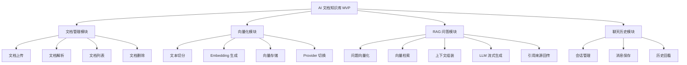
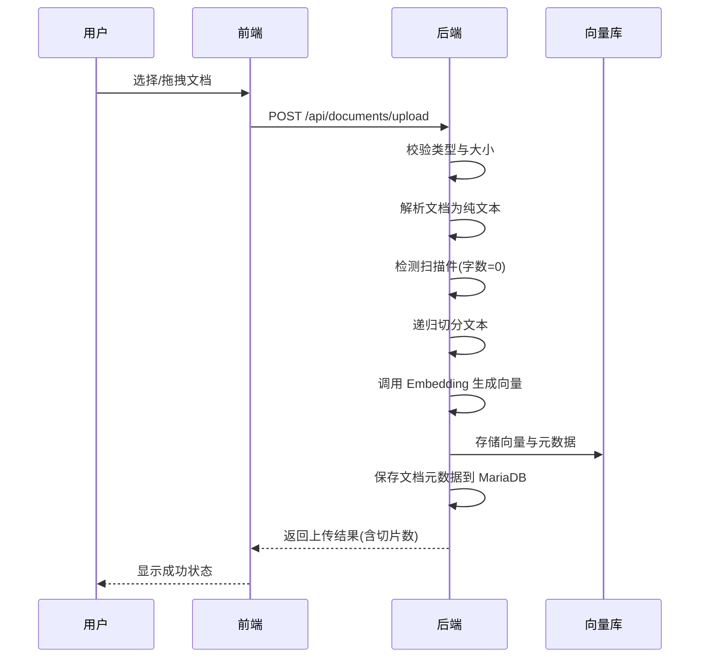
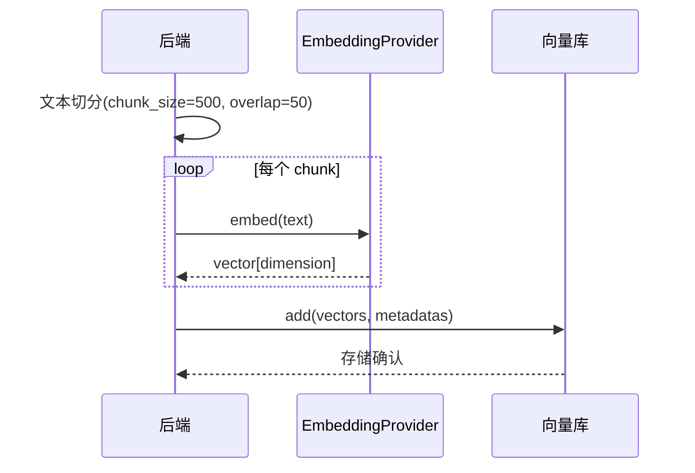
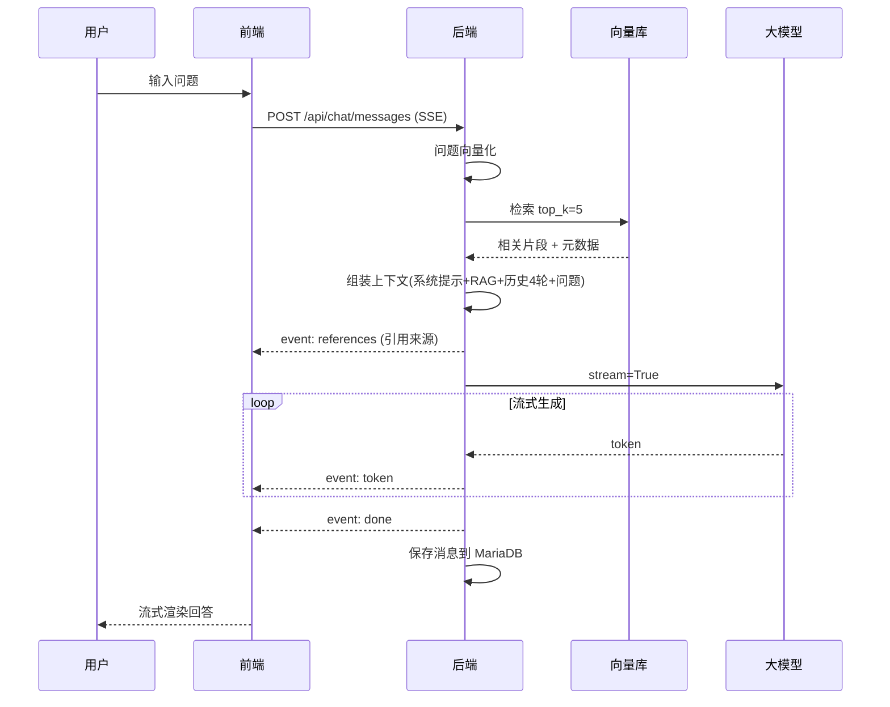
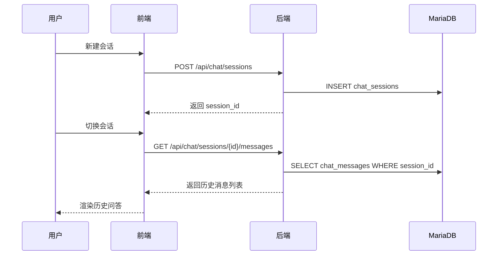
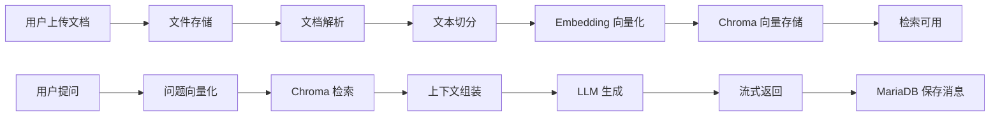

<!--
Document: PRD - Product Requirements Document
Version: 1.0.0
Author: Product Manager
Created: 2026-07-12
Updated: 2026-07-12
Status: Draft
-->

# PRD: AI 文档知识库（MVP）

## 文档元信息

| 字段 | 内容 |
|------|------|
| 文档名称 | 产品需求文档（PRD） |
| 项目名称 | AI 文档知识库（MVP） |
| 版本 | 1.0.0 |
| 作者 | Product Manager |
| 创建日期 | 2026-07-12 |
| 最后更新 | 2026-07-12 |
| 状态 | Approved（Human Developer 已审批通过 2026-07-12） |
| 关联文档 | `docs/project-plan.md`、`docs/decision-log.md`、`docs/tech-review-report.md` |

---

## 1. 产品概述

### 1.1 产品愿景

为个人学习者和开发者提供一个本地运行的 AI 文档知识库，通过 RAG（检索增强生成）技术让用户上传自己的文档后，以自然语言提问即可获得基于文档内容、带引用来源的 AI 回答，实现"个人专属知识助手"。

### 1.2 产品定位

| 维度 | 描述 |
|------|------|
| 产品名称 | AI 文档知识库（MVP） |
| 产品类型 | Web 应用（本地 localhost 运行，前后端分离） |
| 目标用户 | 个人学习者、初级开发者、技术作品集展示者 |
| 核心价值 | 让用户零成本拥有一个基于自有文档的 AI 问答助手，同时作为 RAG 工程的完整作品集项目 |
| 竞品 | LangChain Chat-your-data、Dify（知识库模块）、FastGPT、MaxKB |
| 差异化 | 本地运行零部署成本、双 Embedding 可配置、流式+引用展示、代码清晰适合学习 |
| 部署形态 | 本地 localhost，单用户，并发 1-2（DEC-001） |
| 商业模式 | 无（开源学习项目，不商业化） |

### 1.3 产品目标

| 目标 | 指标 | 目标值 | 时间框架 |
|------|------|--------|----------|
| 跑通 RAG 核心闭环 | 上传→问答成功率 | ≥ 95% | V1 发布 |
| 文档覆盖能力 | 支持文档类型数 | 4 类（PDF/Word/Markdown/TXT） | V1 发布 |
| 问答响应体验 | 单次问答 P95 延迟 | < 15 秒（含 LLM 调用） | V1 发布 |
| 流式首字延迟 | 首 token 返回时间 | < 3 秒 | V1 发布 |
| 检索准确性 | 回答引用来源准确率 | ≥ 80%（人工抽检） | V1 发布 |
| 作品集可读性 | 代码评审通过率 | 100%（G3 通过） | V1 发布 |
| 本地可启动性 | 干净环境一键启动成功率 | 100%（按 README 操作） | V1 发布 |

---

## 2. 用户分析

### 2.1 目标用户

#### 用户画像 1: 个人学习者小李

| 属性 | 描述 |
|------|------|
| 名称 | 小李 |
| 人口统计 | 24 岁，男，计算机相关专业本科毕业 1 年 |
| 技术能力 | 熟悉 Python 基础，了解 Vue，对 AI/LLM 感兴趣但未实际开发过 RAG 应用 |
| 使用场景 | 收集了大量技术文档（PDF 论文、Markdown 笔记、TXT 资料），希望快速检索与提问 |
| 痛点 | 文档太多找不到关键信息；传统搜索只能匹配关键词，无法理解语义；想学 RAG 但缺乏完整项目参考 |
| 目标 | 用自然语言提问获得基于文档的回答；通过本项目学习 RAG 全流程 |
| 技术环境 | 本地有 Python 3.11+、Node.js 18+、有 OpenAI API Key |

#### 用户画像 2: 作品集展示者小张

| 属性 | 描述 |
|------|------|
| 名称 | 小张 |
| 人口统计 | 27 岁，女，转行求职中的前端开发者 |
| 技术能力 | Vue3 熟练，Python 基础，希望作品集展示全栈与 AI 能力 |
| 使用场景 | 将本项目作为作品集核心项目，向面试官展示 RAG 工程能力 |
| 痛点 | 缺乏有技术深度的全栈项目；纯 CRUD 项目缺乏亮点；想展示 AI 能力但不想做玩具级 Demo |
| 目标 | 项目代码清晰可读、架构合理、有完整文档；能向面试官讲清 RAG 原理与工程决策 |
| 技术环境 | 本地开发环境齐全，注重代码质量与文档完整性 |

### 2.2 用户故事

#### Epic 1: 文档管理

| ID | 用户故事 | 优先级 | 验收标准 |
|----|----------|--------|----------|
| US-001 | 作为学习者，我想要上传 PDF/Word/Markdown/TXT 文档，以便将我的资料加入知识库 | P0 | 支持 4 种格式；单文件 ≤ 20MB；上传成功后出现在文档列表 |
| US-002 | 作为学习者，我想要批量上传多个文档，以便快速建立知识库 | P0 | 支持同时选择多个文件上传；每个文件独立处理；显示每个文件上传与解析状态 |
| US-003 | 作为学习者，我想要拖拽上传文档，以便操作更便捷 | P1 | 支持拖拽文件到上传区域；拖拽时高亮提示；释放后自动上传 |
| US-004 | 作为学习者，我想要查看已上传文档列表，以便管理我的知识库 | P0 | 显示文档名、类型、大小、上传时间、切片数、状态；支持分页 |
| US-005 | 作为学习者，我想要删除文档，以便清理过时资料 | P0 | 删除后文档从列表移除；同步删除 Chroma 中对应向量；删除前二次确认 |
| US-006 | 作为学习者，我想要在上传时看到解析与向量化进度，以便了解处理状态 | P1 | 显示"上传中→解析中→切分中→向量化中→完成"状态流转；失败时显示错误原因 |

#### Epic 2: 向量化与知识库

| ID | 用户故事 | 优先级 | 验收标准 |
|----|----------|--------|----------|
| US-007 | 作为学习者，我希望系统自动将上传文档切分并向量化，以便后续检索 | P0 | 上传后自动解析→切分→Embedding→存入 Chroma；全过程无需用户干预 |
| US-008 | 作为学习者，我想要切换 Embedding 方案（OpenAI/本地模型），以便在成本与效果间选择 | P1 | 通过配置切换 provider；切换后需重建索引（UI 提示）；当前 provider 在界面可见 |
| US-009 | 作为学习者，我想要查看知识库统计信息，以便了解知识库规模 | P2 | 显示总文档数、总切片数、当前 Embedding provider、向量维度 |

#### Epic 3: RAG 问答

| ID | 用户故事 | 优先级 | 验收标准 |
|----|----------|--------|----------|
| US-010 | 作为学习者，我想要输入问题并获得基于文档的 AI 回答，以便快速获取知识 | P0 | 输入问题后调用 RAG 管线；回答基于检索到的文档片段；回答在 15s 内完成 |
| US-011 | 作为学习者，我想要流式看到回答逐字显示，以便不必等待完整回答 | P0 | 回答逐 token 流式显示；首 token < 3s；流式过程中可停止生成 |
| US-012 | 作为学习者，我想要看到回答引用的文档来源，以便核实信息出处 | P0 | 引用来源在回答前/下方展示；含文档名、片段预览；点击可定位原文档 |
| US-013 | 作为学习者，我想要在同一会话中追问，以便基于上下文深入提问 | P0 | 支持多轮对话；保留最近 4 轮上下文；超出 4 轮自动截断早期消息 |
| US-014 | 作为学习者，当文档库中无相关内容时，我想要得到明确提示，以便知道回答无依据 | P0 | 检索相似度低于阈值时提示"未在文档库中找到相关内容"；不编造答案 |
| US-015 | 作为学习者，我想要停止正在生成的回答，以便节省时间或重新提问 | P1 | 流式过程中可点击"停止"按钮；停止后已生成内容保留并保存到历史 |

#### Epic 4: 聊天历史

| ID | 用户故事 | 优先级 | 验收标准 |
|----|----------|--------|----------|
| US-016 | 作为学习者，我想要新建会话，以便开始新的话题 | P0 | 点击"新建会话"创建空会话；自动切换到新会话 |
| US-017 | 作为学习者，我想要在多个会话间切换，以便管理不同主题的问答 | P0 | 会话列表显示所有会话；点击切换；当前会话高亮 |
| US-018 | 作为学习者，我想要删除某个会话，以便清理无关问答 | P0 | 删除后从列表移除；删除前二次确认；删除后会话消息一并删除 |
| US-019 | 作为学习者，我想要清空所有会话，以便重置聊天记录 | P1 | 一键清空所有会话；清空前二次确认；清空后不可恢复 |
| US-020 | 作为学习者，我想要刷新页面后仍能看到历史问答，以便回看之前的对话 | P0 | 聊天历史持久化到 MariaDB；刷新后恢复当前会话的历史消息 |

---

## 3. 功能需求

### 3.1 功能模块概述

### 3.2 模块 1: 文档管理

#### 3.2.1 功能描述

文档管理模块负责文档的上传、解析、列表展示与删除。支持 PDF、Word(docx)、Markdown、TXT 四种格式，单文件上限 20MB，总文档数上限 100。文档上传后自动触发解析→切分→向量化流水线。

#### 3.2.2 功能流程

#### 3.2.3 功能细节

| 功能点 | 描述 | 优先级 | 验收标准 |
|--------|------|--------|----------|
| FR-DOC-001: 文档上传 | 支持 PDF/Word(docx)/Markdown/TXT；单文件 ≤ 20MB；支持批量与拖拽 | P0 | 4 种格式均可上传；超限文件被拒绝并提示 |
| FR-DOC-002: 文档解析 | PDF 用 PyPDF2；docx 用 python-docx 提取文本+表格；Markdown 用 markdown 库；TXT 用 chardet 检测编码（优先 UTF-8 回退 GBK） | P0 | 各格式正确解析为纯文本；docx 表格转为文本 |
| FR-DOC-003: 扫描件检测 | 解析后文本字数为 0 时判定为扫描件 | P0 | 扫描件返回友好提示"该 PDF 为扫描件，MVP 暂不支持，需 OCR"；不崩溃 |
| FR-DOC-004: 文档列表 | 显示文档名、类型、大小、上传时间、切片数、状态；支持分页（每页 20 条） | P0 | 列表正确显示所有字段；分页可用 |
| FR-DOC-005: 文档删除 | 删除文档同时删除 Chroma 中对应向量与 MariaDB 元数据 | P0 | 删除后列表更新；Chroma 向量同步删除；删除前二次确认 |
| FR-DOC-006: 总量限制 | 总文档数上限 100 | P1 | 超过 100 时拒绝上传并提示 |
| FR-DOC-007: 上传状态流转 | 显示"上传中→解析中→切分中→向量化中→完成/失败" | P1 | 各状态正确显示；失败时显示错误原因 |

#### 3.2.4 业务规则

| 规则编号 | 规则描述 | 触发条件 | 预期结果 |
|----------|----------|----------|----------|
| BR-DOC-001 | 文件类型校验 | 上传文件扩展名不在 [pdf, docx, md, txt] 内 | 拒绝上传，提示"不支持的文件类型" |
| BR-DOC-002 | 文件大小校验 | 单文件 > 20MB | 拒绝上传，提示"文件超过 20MB 限制" |
| BR-DOC-003 | 文档总数校验 | 已有文档数 ≥ 100 | 拒绝上传，提示"文档数已达上限 100" |
| BR-DOC-004 | 重名文档处理 | 上传同名文档 | 允许上传（不覆盖），列表显示同名项（按时间区分） |
| BR-DOC-005 | 扫描件处理 | PDF 解析后字数 = 0 | 返回提示，不存入向量库，不占用文档计数 |
| BR-DOC-006 | 删除同步 | 删除文档 | 同步删除 Chroma 中该文档所有 chunk 向量；删除 MariaDB 元数据 |

### 3.3 模块 2: 向量化与知识库

#### 3.3.1 功能描述

向量化模块负责将切分后的文本片段通过 Embedding 模型转换为向量并存入 Chroma。支持 OpenAI text-embedding-3-small（1536 维，默认）与本地 bge-m3（1024 维，可选）双方案，通过 Provider 抽象层切换（DEC-008）。切换 provider 需重建索引。

#### 3.3.2 功能流程

#### 3.3.3 功能细节

| 功能点 | 描述 | 优先级 | 验收标准 |
|--------|------|--------|----------|
| FR-VEC-001: 文本切分 | 递归字符切分；chunk_size=500 字符，overlap=50；Markdown 按标题优先切分；清洗多余空白与特殊字符 | P0 | 切分结果均匀；overlap 正确；Markdown 标题边界保留 |
| FR-VEC-002: Embedding 生成 | 默认 OpenAI text-embedding-3-small（1536 维）；可选 bge-m3（1024 维）；通过 .env 配置 EMBEDDING_PROVIDER 切换 | P0 | 两种 provider 均可生成向量；维度正确 |
| FR-VEC-003: 向量存储 | Chroma 嵌入式持久化；数据落本地 ./data/chroma；collection 命名含 provider 与维度（如 kb_openai_1536） | P0 | 向量正确存入；元数据完整；持久化到磁盘 |
| FR-VEC-004: 元数据字段 | 每个 chunk 存储：doc_id、doc_name、chunk_index、source_path、char_count | P0 | 元数据字段完整可查 |
| FR-VEC-005: Provider 切换提示 | 切换 provider 需重建索引（维度不同）；UI 提示用户 | P1 | 切换时弹出提示"切换 Embedding 方案需重建索引，确定？" |
| FR-VEC-006: 知识库统计 | 显示总文档数、总切片数、当前 provider、向量维度 | P2 | 统计信息正确显示 |

#### 3.3.4 业务规则

| 规则编号 | 规则描述 | 触发条件 | 预期结果 |
|----------|----------|----------|----------|
| BR-VEC-001 | Collection 隔离 | 切换 Embedding provider | 使用新 collection（如 kb_bge-m3_1024），旧 collection 保留但不使用 |
| BR-VEC-002 | 索引重建 | 切换 provider 后 | 需对所有已上传文档重新 Embedding；UI 提示重建进度 |
| BR-VEC-003 | 切分参数 | 文本切分 | chunk_size=500，overlap=50（可配置，默认值见 DEC-006） |
| BR-VEC-004 | 模型下载 | 首次使用本地 bge-m3 | 自动下载 2.3GB 模型；文档说明下载步骤与缓存目录 |

### 3.4 模块 3: RAG 问答

#### 3.4.1 功能描述

RAG 问答模块是核心功能。用户输入问题后，系统将问题向量化并检索 top_k=5 相关片段，组装上下文（系统提示 + RAG 上下文 + 最近 4 轮历史 + 当前问题），调用 LLM 流式生成回答，并在回答前发送引用来源。支持多轮对话与停止生成。

#### 3.4.2 功能流程

#### 3.4.3 功能细节

| 功能点 | 描述 | 优先级 | 验收标准 |
|--------|------|--------|----------|
| FR-RAG-001: 问题向量化 | 将用户问题通过当前 Embedding provider 转为向量 | P0 | 向量维度与 collection 一致 |
| FR-RAG-002: 向量检索 | Chroma 检索 top_k=5；相似度阈值 0.3（可配置） | P0 | 返回 top 5 相关片段；低于阈值的过滤 |
| FR-RAG-003: 上下文组装 | 系统提示(~200 token) + RAG 上下文(top_k=5×500字符) + 最近 4 轮(8 条消息) + 当前问题；Token 预算 ~6000 | P0 | 上下文按序组装；超 4 轮自动截断；Token 不超限 |
| FR-RAG-004: LLM 调用 | OpenAI gpt-4o-mini（默认）；支持 base_url 配置兼容端点；stream=True | P0 | 流式返回 token；非流式降级可用 |
| FR-RAG-005: 引用来源回传 | references 事件先于 token 发送；含 doc_name、chunk 预览、source_path | P0 | 引用先于回答显示；字段完整 |
| FR-RAG-006: 流式输出 | SSE event: token 逐字返回；event: done 结束；event: error 异常 | P0 | 流式正常；首 token < 3s；可中断 |
| FR-RAG-007: 停止生成 | 前端"停止"按钮中断流式 | P1 | 停止后已生成内容保留并保存 |
| FR-RAG-008: 无相关内容提示 | 检索结果低于阈值时 | P0 | 提示"未在文档库中找到相关内容"；不调用 LLM 编造 |
| FR-RAG-009: 多轮上下文 | 保留最近 4 轮(8 条消息)；按轮数截断；会话级隔离 | P0 | 第 5 轮时第 1 轮不进入上下文；不同会话独立 |
| FR-RAG-010: 错误处理 | LLM 超时/失败、网络错误 | P0 | 返回 event: error；前端显示友好错误；可重试 |

#### 3.4.4 业务规则

| 规则编号 | 规则描述 | 触发条件 | 预期结果 |
|----------|----------|----------|----------|
| BR-RAG-001 | 检索阈值 | 相似度 < 0.3 | 片段不纳入上下文；若全部低于阈值则触发 FR-RAG-008 |
| BR-RAG-002 | 上下文截断 | 历史消息 > 4 轮 | 保留最近 4 轮(8 条)，更早的丢弃；按轮数截断保证完整性 |
| BR-RAG-003 | Token 预算 | 总 token > 6000 | 优先保留系统提示与 RAG 上下文，截断历史 |
| BR-RAG-004 | 会话隔离 | 不同会话 | 上下文不跨会话；切换会话时重新加载该会话历史 |
| BR-RAG-005 | 引用顺序 | 发送引用 | references 事件在首个 token 事件之前发送 |
| BR-RAG-006 | 消息保存 | 回答完成(done) | 保存问题、回答、引用 JSON、耗时到 MariaDB chat_messages 表 |
| BR-RAG-007 | LLM 超时 | LLM 调用 > 30s | 返回 event: error "回答生成超时，请重试" |

### 3.5 模块 4: 聊天历史

#### 3.5.1 功能描述

聊天历史模块负责会话与消息的持久化管理。支持新建会话、切换会话、删除会话、清空所有会话。消息字段包含会话 ID、问题、回答、引用来源 JSON、关联文档、耗时、时间戳。历史持久化到 MariaDB，刷新后可恢复。

#### 3.5.2 功能流程

#### 3.5.3 功能细节

| 功能点 | 描述 | 优先级 | 验收标准 |
|--------|------|--------|----------|
| FR-HIS-001: 新建会话 | 创建新会话，自动切换 | P0 | 新会话出现在列表；当前会话切换为新会话 |
| FR-HIS-002: 会话列表 | 显示所有会话；含标题(取首条问题前 20 字)、消息数、最后活跃时间；按时间倒序 | P0 | 列表正确显示；排序正确 |
| FR-HIS-003: 切换会话 | 点击会话切换；加载该会话历史消息 | P0 | 切换后显示对应历史；当前会话高亮 |
| FR-HIS-004: 删除会话 | 删除单个会话及其所有消息；二次确认 | P0 | 删除后列表更新；消息一并删除；不可恢复 |
| FR-HIS-005: 清空会话 | 一键清空所有会话；二次确认 | P1 | 所有会话删除；不可恢复 |
| FR-HIS-006: 历史持久化 | 消息保存到 MariaDB；刷新后恢复 | P0 | 刷新页面后当前会话历史仍在 |
| FR-HIS-007: 消息字段 | session_id、question、answer、references(JSON)、doc_ids、elapsed_ms、created_at | P0 | 所有字段正确保存与读取 |
| FR-HIS-008: 会话标题 | 默认取首条问题前 20 字符作为标题 | P2 | 标题正确生成；无消息时显示"新会话" |

#### 3.5.4 业务规则

| 规则编号 | 规则描述 | 触发条件 | 预期结果 |
|----------|----------|----------|----------|
| BR-HIS-001 | 删除确认 | 删除会话/清空会话 | 弹出确认对话框；确认后执行 |
| BR-HIS-002 | 级联删除 | 删除会话 | 该会话所有 chat_messages 一并删除 |
| BR-HIS-003 | 会话上限 | 会话数 > 50 | MVP 不做硬限制，但建议定期清理（非强制） |
| BR-HIS-004 | 引用 JSON 格式 | 保存引用 | `[{"doc_name":"...", "chunk":"...", "source_path":"..."}]` |

---

## 4. 非功能需求

### 4.1 性能需求

| 指标 | 目标值 | 测量方法 | 依据 |
|------|--------|----------|------|
| 单次问答 P95 延迟 | < 15 秒（含 LLM 调用） | 后端计时 + 前端体验 | DEC-006 |
| 流式首 token 延迟 | < 3 秒 | 前端计时（从发送到首个 token） | DEC-010 |
| 文档上传解析延迟（1MB 文档） | < 10 秒 | 后端计时 | 合理体验 |
| Embedding 生成延迟（单 chunk） | < 2 秒（OpenAI）/ < 5 秒（本地首次加载后） | 后端计时 | DEC-012 |
| 页面首次加载时间 | < 3 秒 | Lighthouse | 合理体验 |
| API 响应时间（非 LLM 接口） | < 500ms (P95) | 后端监控 | 合理体验 |
| 并发用户数 | 1-2 | 本地单用户 | DEC-001/006 |

### 4.2 安全需求

| 需求 | 说明 | 优先级 | 依据 |
|------|------|--------|------|
| API Key 管理 | OpenAI API Key 通过 .env 管理，不硬编码、不提交 Git | P0 | DEC-006 |
| 文件上传安全 | 校验文件类型(扩展名+魔数)、大小(≤20MB)；存储路径不可穿越 | P0 | DEC-006 |
| 输入验证 | 所有 API 输入校验类型与长度；防 SQL 注入(SQLAlchemy 参数化) | P0 | 安全最佳实践 |
| XSS 防护 | 前端输出转义；回答内容不直接 innerHTML | P0 | 安全最佳实践 |
| 本地运行 | 仅绑定 localhost，不对外发布；无需认证 | P0 | DEC-001 |
| 数据存储安全 | MariaDB 本地；Chroma 本地；无云端传输(除 OpenAI API) | P0 | DEC-001/005 |

> 注：因本地运行无需认证（DEC-001），安全需求聚焦于 API Key 管理、文件上传安全与输入验证。详细安全审计在 Phase 4 由安全工程师执行。

### 4.3 可用性需求

| 指标 | 目标值 | 说明 |
|------|--------|------|
| 系统可用性 | 本地运行，按需启动 | 无 SLA 要求（个人使用） |
| 故障恢复 | 重启应用即可恢复 | 本地运行无高可用需求 |
| 数据备份 | 手动备份 ./data/chroma 与 MariaDB | 文档说明备份方法（DEC-013 债务 7） |
| 错误处理 | 所有错误有友好提示 | 不暴露堆栈信息给用户 |

### 4.4 兼容性需求

| 平台 | 支持版本 | 依据 |
|------|----------|------|
| Chrome | 最新版 | DEC-006 |
| Edge | 最新版 | DEC-006 |
| Firefox | 最新版 | DEC-006 |
| Safari | 不保证 | 非 MVP 目标 |
| 操作系统 | 跨平台（Windows/macOS/Linux） | Python + Node.js 跨平台 |
| Python | 3.11+ | DEC-007 |
| Node.js | 18+ | Vite 5 要求 |
| MariaDB | 10.11+ | DEC-007 |

### 4.5 可扩展性需求

| 需求 | 说明 | 依据 |
|------|------|------|
| Embedding Provider 扩展 | 抽象层支持新增 provider（DEC-008） | DEC-002/008 |
| LLM Provider 扩展 | 抽象层支持新增 provider（DEC-009） | DEC-009 |
| 多知识库扩展点 | Chroma collection 概念预留，V1 仅单一全局库 | DEC-008 |
| 多用户扩展点 | 数据模型预留 user_id 字段空间（可选），V1 不实现 | 架构师评估 |

### 4.6 用户体验需求

| 需求 | 说明 |
|------|------|
| 界面语言 | 简体中文（DEC-006） |
| 布局 | 左右分栏：左侧会话/文档列表，右侧对话区 |
| 流式体验 | 回答逐字显示，引用来源先于回答展示 |
| 空状态 | 文档库空、会话空时有引导提示 |
| 加载状态 | 上传、解析、向量化、检索各有明确加载提示 |
| 错误状态 | 错误有友好提示与重试按钮 |
| 暗色模式 | V1 不做（DEC-013 债务） |

---

## 5. 数据需求

### 5.1 数据实体

| 实体 | 描述 | 主要字段 | 存储位置 |
|------|------|----------|----------|
| documents | 文档元数据 | id, filename, file_type, file_size, file_path, chunk_count, status, created_at | MariaDB |
| chat_sessions | 聊天会话 | id, title, message_count, last_active_at, created_at | MariaDB |
| chat_messages | 聊天消息 | id, session_id, question, answer, references(JSON), doc_ids(JSON), elapsed_ms, created_at | MariaDB |
| document_chunks | 文档片段向量 | id, doc_id, chunk_text, embedding, metadata | Chroma |
| app_config | 应用配置（可选） | provider, dimension, chunk_size, top_k, similarity_threshold | .env / 配置文件 |

### 5.2 数据流

> 注：数据实体的最终 Schema 由数据库工程师（Phase 2）设计，本节为产品视角的数据需求。

---

## 6. 集成需求

### 6.1 外部系统集成

| 系统 | 集成方式 | 用途 | 依据 |
|------|----------|------|------|
| OpenAI API | HTTPS REST (openai SDK) | Embedding + LLM 调用 | DEC-007 |
| OpenAI 兼容端点 | HTTPS REST (base_url 配置) | LLM 备选方案 | DEC-009 |

### 6.2 第三方服务

| 服务 | 用途 | 备选方案 | 依据 |
|------|------|----------|------|
| OpenAI text-embedding-3-small | 默认 Embedding | bge-m3 本地模型 | DEC-002/012 |
| OpenAI gpt-4o-mini | 默认 LLM | 任意 OpenAI 兼容端点 | DEC-009 |
| HuggingFace（bge-m3 下载） | 本地模型下载源 | 镜像站/手动下载 | DEC-012 |

---

## 7. 约束与假设

### 7.1 约束

| 编号 | 约束 | 来源 | 影响 |
|------|------|------|------|
| C1 | 全项目禁用 Docker | Human Developer（DEC-005） | 部署方案改为本地脚本；MariaDB 本地安装；Chroma 嵌入式 |
| C2 | MariaDB 本地安装 | Human Developer（DEC-005） | 需提供详细安装文档；启动脚本检测依赖 |
| C3 | 仅本地 localhost 运行 | Human Developer（DEC-001） | 无需认证、无需 HTTPS；uvicorn 绑定 127.0.0.1 |
| C4 | 初级开发者独立完成 | 项目定位 | 控制复杂度；不引入 langchain；文本切分自实现 |
| C5 | 中文文档英文代码命名 | Human Developer | 文档与注释中文；变量函数英文 |
| C6 | 文档统一存放 docs 目录 | Human Developer | 所有交付文档在 docs/ |
| C7 | 不引入 langchain | DEC-007 | 文本切分自实现约 100 行 |
| C8 | Embedding 维度不统一（1536 vs 1024） | DEC-002/012 | 切换 provider 需重建索引 |

### 7.2 假设

| 编号 | 假设 | 验证状态 | 影响 |
|------|------|----------|------|
| A1 | 开发者本地具备 Python 3.11+ 与 Node.js 18+ | 待运维确认 | 影响环境搭建 |
| A2 | 开发者有可用 OpenAI API Key | 待确认 | 无 Key 时需用本地 Embedding + 兼容 LLM 端点 |
| A3 | 开发者可本地安装 MariaDB 10.11+ | 待运维确认 | 影响业务数据存储 |
| A4 | 文档样本以中文为主，少量英文 | 已确认（DEC-006） | bge-m3 多语言能力覆盖 |
| A5 | 本地 bge-m3 首次下载可接受 2.3GB | 待 Human Developer 确认 | 影响本地 Embedding 方案可用性 |
| A6 | OpenAI API 网络可访问（或兼容端点） | 待确认 | 影响 LLM 与默认 Embedding 可用性 |

### 7.3 已知限制（基于技术债务 DEC-013）

以下限制在 V1 可接受，后续版本偿还：

| 限制 | 严重程度 | 计划偿还 | 说明 |
|------|----------|----------|------|
| 不支持 OCR | - | V2 | 扫描件 PDF 仅友好提示 |
| 不支持暗色模式 | Low | V2 | 界面仅亮色 |
| 不支持聊天记录导出 | Low | V2 | 历史仅可在界面查看 |
| 多轮对话仅保留最近 4 轮 | Low | V2 | 超出自动截断 |
| 切换 Embedding 需重建索引 | Low | V2 | 维度不同导致 |
| 本地模型首次下载 2.3GB | Medium | V1.5 | 文档说明缓存 |
| 不做 Rerank 重排序 | Low | V2 | 检索质量可接受 |
| 不做全文搜索 | Low | V2 | 向量检索满足核心需求 |
| Chroma 无自动备份 | Medium | V1.5 | 手动备份文档说明 |
| 前端组件测试较薄 | Medium | V2 | 后端覆盖率 ≥ 80% |
| 错误码体系简化 | Low | V2 | HTTP 状态码 + 消息 |
| 无日志集中收集 | Low | V2 | 本地日志文件 |

---

## 8. 优先级排序

### 8.1 MVP 范围（V1 必须实现）

| 功能 | 优先级 | 理由 | 对应用户故事 |
|------|--------|------|--------------|
| 文档上传（4 种格式） | P0 | RAG 闭环起点，无此则无知识库 | US-001/002 |
| 文档解析与切分 | P0 | RAG 闭环核心环节 | US-007 |
| 向量化与 Chroma 存储 | P0 | RAG 检索基础 | US-007 |
| RAG 问答（检索+LLM 生成） | P0 | 核心价值，无此则产品无意义 | US-010 |
| 流式输出 | P0 | 用户体验关键，作品集展示点 | US-011 |
| 引用来源展示 | P0 | RAG 可解释性核心，作品集展示点 | US-012 |
| 多轮对话 | P0 | Human Developer 明确选择 | US-013 |
| 聊天历史持久化 | P0 | 刷新后恢复是基本体验 | US-020 |
| 会话管理（新建/切换/删除） | P0 | 多轮对话必需 | US-016/017/018 |
| 文档列表与删除 | P0 | 知识库管理基本功能 | US-004/005 |
| 无相关内容提示 | P0 | 防止 AI 编造，保证可信度 | US-014 |
| 扫描件检测与提示 | P0 | 防止崩溃，友好体验 | (FR-DOC-003) |
| 错误处理与友好提示 | P0 | 基本可用性 | (FR-RAG-010) |
| 拖拽上传 | P1 | 提升体验，非核心 | US-003 |
| 上传状态流转 | P1 | 提升体验 | US-006 |
| Embedding Provider 切换 | P1 | DEC-002 要求，但默认 OpenAI 可用 | US-008 |
| 停止生成 | P1 | 提升体验 | US-015 |
| 清空所有会话 | P1 | 便利功能 | US-019 |

### 8.2 后续迭代

| 功能 | 优先级 | 计划迭代 | 理由 |
|------|--------|----------|------|
| 知识库统计信息 | P2 | V1.1 | 锦上添花 |
| 会话标题智能生成 | P2 | V1.1 | 当前取首条问题前 20 字够用 |
| OCR 支持 | P3 | V2 | 复杂度高，需额外依赖 |
| 暗色模式 | P3 | V2 | 体验优化 |
| 聊天记录导出 | P3 | V2 | 便利功能 |
| Rerank 重排序 | P3 | V2 | 检索质量提升 |
| 全文搜索 | P3 | V2 | 检索能力扩展 |
| 多知识库管理 | P3 | V2 | 扩展功能 |
| 多用户与权限 | P3 | V2 | 扩展功能 |
| Chroma 自动备份 | P3 | V1.5 | 数据安全 |

### 8.3 Won't Have（V1 明确不做）

- 插件系统、MCP、多 Agent、工作流编排
- 微服务架构、消息队列
- Docker 容器化（C1 约束）
- 公网部署与在线演示

---

## 9. 验收标准

### 9.1 功能验收

| 功能 | 验收标准 | 验收方法 | 对应成功标准 |
|------|----------|----------|--------------|
| 文档上传 | 4 种格式均可上传成功；超限文件被拒绝 | 实际上传各格式文件测试 | S1 |
| 文档解析 | 各格式正确解析为文本；docx 表格正确提取 | 检查解析结果 | S1 |
| 文本切分 | chunk_size=500，overlap=50 正确 | 检查 Chroma 中 chunk 数与长度 | S1 |
| 向量化 | 向量存入 Chroma；元数据完整 | 查询 Chroma 验证向量数与元数据 | S1 |
| RAG 问答 | 提问获得基于文档的回答；引用准确 | 实际提问核对回答与引用 | S2 |
| 流式输出 | 回答逐字显示；首 token < 3s | 实际提问观察流式效果 | S2 |
| 引用来源 | 引用先于回答展示；字段完整 | 实际提问观察引用区 | S2 |
| 多轮对话 | 可追问；上下文保留 4 轮 | 多轮提问测试 | S2 |
| 聊天历史 | 刷新后历史恢复 | 对话后刷新页面验证 | S3 |
| 会话管理 | 新建/切换/删除正常 | 实际操作测试 | S3 |
| 文档删除 | 删除后向量同步删除 | 删除后查询 Chroma 验证 | S1 |
| 无相关内容 | 提问无关内容时提示 | 提问知识库外问题测试 | S2 |
| 扫描件处理 | 友好提示不崩溃 | 上传扫描件 PDF 测试 | S1 |

### 9.2 非功能验收

| 指标 | 验收标准 | 验收方法 |
|------|----------|----------|
| 性能 | 单次问答 P95 < 15s；首 token < 3s | 压力测试 + 实际体验 |
| 并发 | 1-2 并发正常 | 本地多窗口测试 |
| 兼容性 | Chrome/Edge/Firefox 最新版正常 | 跨浏览器测试 |
| 安全 | API Key 无硬编码；文件上传校验；输入验证 | 安全审计（G5） |
| 代码质量 | 单元测试覆盖率 ≥ 80%（后端）；代码评审通过 | 代码审查（G3） |
| 可启动性 | 干净环境按 README 启动成功 | 全新环境部署测试（G6） |
| 文档完整性 | README + 部署文档 + 截图齐全 | 文档审查 |

### 9.3 成功标准对照

| 成功标准 | 验收方式 | 责任阶段 |
|----------|----------|----------|
| S1: 可上传 4 类文档并完成解析切分向量化 | 实际上传，检查 Chroma 向量数 | Phase 2-3 |
| S2: 提问可基于文档内容回答并标注引用来源 | 实际提问，核对回答与引用 | Phase 3-4 |
| S3: 聊天历史可保存与回看 | 多轮对话后刷新验证 | Phase 3-4 |
| S4: 项目可一键本地启动运行 | 干净环境按 README 启动 | Phase 5 |
| S5: 代码结构清晰、有 README 与部署文档 | 代码评审 + 文档审查 | Phase 4-5 |

---

## 10. 附录

### 10.1 术语表

| 术语 | 定义 |
|------|------|
| RAG | Retrieval-Augmented Generation，检索增强生成。先检索相关文档片段，再将其作为上下文输入 LLM 生成回答 |
| Embedding | 将文本转换为向量表示，使语义相近的文本向量距离相近 |
| Chroma | 开源向量数据库，本项目使用其嵌入式持久化模式 |
| chunk | 文本切分后的片段，本项目 chunk_size=500 字符 |
| top_k | 向量检索返回的最相似结果数量，本项目 top_k=5 |
| SSE | Server-Sent Events，服务器推送事件，用于流式输出 |
| Provider | 抽象层接口，统一不同 Embedding/LLM 服务的调用方式 |
| Token | LLM 处理文本的最小单位，约 1 token = 0.75 英文单词 / 0.5 中文字 |
| overlap | 文本切分时相邻 chunk 的重叠字符数，本项目 overlap=50 |
| bge-m3 | BAAI 开源的多语言 Embedding 模型，1024 维 |
| MariaDB | MySQL 分支的开源关系型数据库 |

### 10.2 参考文档

| 文档 | 路径 | 说明 |
|------|------|------|
| 项目规划 | `docs/project-plan.md` | 项目概述、范围、风险、约束 |
| 决策日志 | `docs/decision-log.md` | 13 项技术决策（DEC-001~013） |
| 技术评审报告 | `docs/tech-review-report.md` | Phase 0 技术选型评审 |
| Tech Lead 交接 | `docs/handoffs/handoff-techlead-to-pm.md` | 技术选型结论 |
| Todo 清单 | `docs/todo.md` | Phase 0~5 任务 |

### 10.3 技术决策引用

本 PRD 基于以下技术决策编写，功能需求在决策约束边界内设计：

| 决策编号 | 标题 | PRD 影响章节 |
|----------|------|--------------|
| DEC-001 | 本地 localhost 运行 | 1.2 产品定位、4.2 安全需求 |
| DEC-002 | Embedding 双方案 | 3.3 向量化模块、6.2 第三方服务 |
| DEC-003 | 多轮对话 | 3.4 RAG 问答、US-013 |
| DEC-004 | 流式+引用 | 3.4 RAG 问答、US-011/012 |
| DEC-005 | 禁用 Docker | 7.1 约束 C1/C2 |
| DEC-006 | V1 范围与参数 | 全文（chunk_size、top_k、阈值等） |
| DEC-007 | 技术栈确认 | 4.4 兼容性、7.1 约束 C7 |
| DEC-008 | Embedding Provider 抽象层 | 3.3 向量化模块 |
| DEC-009 | LLM Provider 抽象层 | 3.4 RAG 问答、6.1 集成 |
| DEC-010 | SSE 流式方案 | 3.4 RAG 问答、US-011 |
| DEC-011 | 上下文截断策略 | 3.4 RAG 问答、BR-RAG-002/003 |
| DEC-012 | bge-m3 本地模型 | 3.3 向量化模块、6.2 第三方服务 |
| DEC-013 | 技术债务基线 | 7.3 已知限制 |

### 10.4 变更历史

| 版本 | 日期 | 变更说明 | 作者 |
|------|------|----------|------|
| 1.0.0 | 2026-07-12 | 初始版本，基于 DEC-001~013 编写完整 PRD | Product Manager |

---

**本 PRD 是产品需求的唯一真实来源。所有功能需求以此为准，技术实现需在 DEC-001~013 约束边界内进行。PRD 须经 Human Developer 审批（G1）后生效。**
