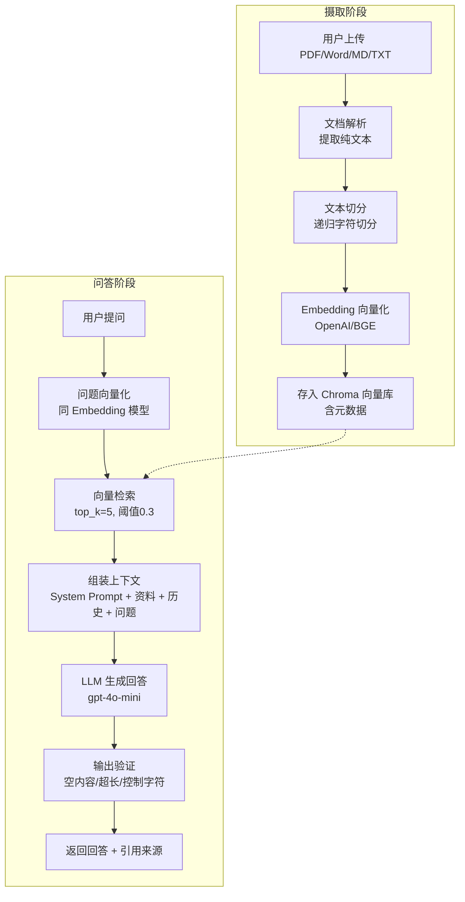

<!--
Document: RAG Principle Explanation
Version: 1.0.0
Author: AI Engineer
Created: 2026-07-12
Updated: 2026-07-12
-->

# RAG 原理说明（面向初级开发者）

> 本文档面向初学者，解释 RAG（检索增强生成）的工作原理，以及本项目中 RAG 管线的具体实现。
> 阅读本文后，你应能理解：RAG 是什么、为什么需要 RAG、本项目的 RAG 管线如何运作、关键参数的含义。

---

## 1. 什么是 RAG？

### 1.1 一句话定义

**RAG（Retrieval-Augmented Generation，检索增强生成）** 是一种让大语言模型（LLM）在回答问题前，先从知识库中"查资料"，再基于查到的资料生成回答的技术。

### 1.2 为什么需要 RAG？

直接使用 LLM 回答问题有几个痛点：

| 痛点 | 不用 RAG | 用 RAG |
|------|----------|--------|
| **知识时效性** | 模型训练数据有截止日期，不知道新知识 | 知识库可随时更新，模型基于最新资料回答 |
| **领域知识** | 模型不了解你的私有文档（如公司内部资料） | 可将私有文档导入知识库，模型基于你的文档回答 |
| **幻觉（Hallucination）** | 模型可能编造看似合理但错误的内容 | 模型基于检索到的真实资料回答，降低编造概率 |
| **可追溯性** | 无法知道答案从哪来 | 每个回答都附带引用来源（文档名、片段） |
| **成本** | 微调模型需要大量数据和算力 | 无需训练，只需更新知识库 |

### 1.3 一个生活化的比喻

想象你在考试：

- **不用 RAG** = 闭卷考试。你只能靠脑子里记住的知识答题，记不清的地方可能瞎编。
- **用 RAG** = 开卷考试。你可以先翻书找相关章节，再根据找到的内容答题，还能标注引用页码。

RAG 就是给 LLM 开卷考试的能力。

---

## 2. RAG 工作流程

### 2.1 全景图

RAG 系统分为两个阶段：

```
阶段一：文档摄取（离线，用户上传文档时触发）
─────────────────────────────────────────────
用户上传文档 → 解析文本 → 切分片段 → 生成向量 → 存入向量库

阶段二：问答检索（在线，用户提问时触发）
─────────────────────────────────────────────
用户提问 → 生成问题向量 → 向量检索 → 组装上下文 → LLM 生成回答 → 输出验证
```

### 2.2 本项目管线流程



---

## 3. 各组件详解

### 3.1 文档解析（Parsing）

**作用**：把用户上传的文件（PDF、Word、Markdown、TXT）转换成纯文本。

**本项目实现**：`backend/app/parsers/`

| 文件类型 | 解析器 | 说明 |
|----------|--------|------|
| PDF | `pdf_parser.py` | 基于 PyPDF2，**不支持扫描型 PDF**（无文本层的图片型 PDF 会报错） |
| Word (.docx) | `docx_parser.py` | 基于 python-docx |
| Markdown (.md) | `markdown_parser.py` | 直接读取文本 |
| TXT | `txt_parser.py` | 直接读取文本 |

**为什么不支持扫描型 PDF？**
扫描型 PDF 本质是图片，没有文本层，需要 OCR（光学字符识别）才能提取文字。OCR 属于 MVP 范围外的复杂功能，本项目对扫描型 PDF 返回友好错误提示。

### 3.2 文本切分（Chunking）

**作用**：把长文档切成小片段（chunk），因为：
1. Embedding 模型对输入长度有限制
2. 检索时小片段更精准，能定位到具体段落
3. LLM 上下文窗口有限，不能塞入整篇文档

**本项目策略**：递归字符切分（Recursive Character Splitting）

```
切分逻辑（优先级从高到低）:
1. 优先按 Markdown 标题切分（# ## ###）
2. 标题内按段落切分（\n\n）
3. 段落内按句号切分（。.）
4. 句子内按字符数强制切分
```

**关键参数**：

| 参数 | 默认值 | 说明 |
|------|--------|------|
| `chunk_size` | 500 字符 | 每个 chunk 的目标长度 |
| `overlap` | 50 字符 | 相邻 chunk 的重叠部分，保证上下文连续性 |

**为什么需要 overlap（重叠）？**
如果一段关键信息刚好被切在两个 chunk 的边界，检索时可能只命中半个，导致回答不完整。重叠 50 字符确保边界信息在两个 chunk 中都出现。

### 3.3 向量化（Embedding）

**作用**：把文本转换成高维向量（一组浮点数），让计算机能计算"语义相似度"。

**直觉理解**：
- 把每段文本映射到"语义空间"中的一个点
- 语义相近的文本，在空间中距离也近
- 用户问题与文档片段的语义相似度，就是它们向量之间的距离

**本项目实现**：`backend/app/providers/embedding/`

| Provider | 模型 | 维度 | 说明 |
|----------|------|------|------|
| OpenAI | text-embedding-3-small | 1536 | 默认，需 API Key |
| BGE（本地） | bge-m3 | 1024 | 可选，本地运行，无需 API Key |

**Provider 抽象层**：

```python
class EmbeddingProvider(ABC):
    @abstractmethod
    async def embed(self, texts: list[str]) -> list[list[float]]:
        """批量向量化文档片段。"""
        ...

    @abstractmethod
    async def embed_query(self, query: str) -> list[float]:
        """向量化用户查询。"""
        ...
```

通过抽象层，切换 Embedding 模型只需改配置（`EMBEDDING_PROVIDER=openai|bge`），业务代码无需改动。

### 3.4 向量存储（Vector Store）

**作用**：把向量及其元数据存下来，支持高效检索。

**本项目使用**：Chroma（嵌入式向量数据库，无需独立部署）

**存储结构**：
```
Collection: kb_{provider}_{dim}
  例: kb_openai_1536  或  kb_bge_1024

每条记录包含:
- id: 片段唯一 ID
- embedding: 向量（1536 或 1024 维）
- document: 片段文本内容
- metadata:
    - doc_id: 所属文档 ID（用于删除时级联）
    - doc_name: 文档名（用于引用来源展示）
    - chunk_index: 片段序号
    - source_path: 源文件路径
    - char_count: 字符数
```

**为什么用 Chroma？**
- 嵌入式：无需独立部署，直接嵌入 Python 进程
- 持久化：数据存在 `./data/chroma` 目录
- 轻量：适合 MVP 规模（千级文档片段）

### 3.5 检索（Retrieval）

**作用**：用户提问时，从向量库中找出最相关的 N 个文档片段。

**流程**：
1. 用同一个 Embedding 模型把用户问题转成向量
2. 在 Chroma 中计算问题向量与所有文档向量的相似度
3. 返回相似度最高的 top_k 个片段

**关键参数**：

| 参数 | 默认值 | 说明 |
|------|--------|------|
| `top_k` | 5 | 返回最相关的 5 个片段 |
| `similarity_threshold` | 0.3 | 相似度低于 0.3 的片段被过滤（避免返回无关内容） |

**注意**：Embedding 模型与查询时必须用同一个模型，否则向量空间不一致，相似度计算无意义。

### 3.6 上下文组装（Context Assembly）

**作用**：把检索到的资料、历史对话、用户问题组装成 LLM 能理解的消息列表。

**组装顺序**（DEC-011）：

```
1. System Prompt（角色设定 + 回答规则）           ← role: system
2. 检索上下文（RAG Context，作为补充 system 消息）  ← role: system
3. 历史对话（最近 4 轮 = 8 条消息）                ← role: user / assistant
4. 当前用户问题                                    ← role: user
```

**为什么限制 4 轮历史？**
- Token 消耗：历史越长，API 费用越高
- 性能：上下文越长，LLM 推理越慢
- 有效性：远期历史对话对当前问题的参考价值递减

### 3.7 LLM 生成（Generation）

**作用**：把组装好的消息列表发给 LLM，让它生成回答。

**本项目使用**：OpenAI gpt-4o-mini（默认，可配置）

**两种模式**：
- **非流式**：等待 LLM 完整生成后一次性返回（用于多轮对话保存）
- **流式（SSE）**：LLM 边生成边返回 token，前端实时渲染（用户体验更好）

**System Prompt 核心约束**（详见 [prompts.md](./prompts.md)）：
- 必须基于检索资料回答，不编造
- 资料不足时明确说明，不拼凑
- 不暴露内部机制（如"参考资料""System Prompt"等词）

### 3.8 输出验证（Output Guard）

**作用**：LLM 输出不可信，必须验证后才返回给用户。

**验证流程**（`backend/app/services/output_guard.py`）：

```
1. 空内容检测 → 返回友好占位提示
2. 控制字符过滤 → 移除不可见字符（保留 \n \t）
3. 超长截断 → 超过 8000 字符截断
4. Prompt 泄漏检测 → 记录日志（MVP 不拦截）
```

### 3.9 引用来源回传

**作用**：让用户知道答案来自哪个文档的哪个片段，便于核对。

**实现**：检索阶段返回的每个片段都带 `metadata`（doc_id, doc_name, chunk_index, source_path），这些信息通过 SSE 的 `references` 事件回传给前端：

```
event: references
data: [{"doc_id": "...", "doc_name": "test.pdf", "chunk_index": 0, "source_path": "uploads/test.pdf"}]
```

前端在回答下方展示引用来源列表，用户可点击查看原文。

---

## 4. 本项目参数速查

| 模块 | 参数 | 默认值 | 配置项 | 说明 |
|------|------|--------|--------|------|
| 文本切分 | chunk_size | 500 字符 | `CHUNK_SIZE` | 每个 chunk 目标长度 |
| 文本切分 | overlap | 50 字符 | `CHUNK_OVERLAP` | 相邻 chunk 重叠长度 |
| 检索 | top_k | 5 | `RETRIEVAL_TOP_K` | 返回最相关的片段数 |
| 检索 | similarity_threshold | 0.3 | `SIMILARITY_THRESHOLD` | 相似度过滤阈值 |
| 上下文 | max_history_rounds | 4 轮 | `MAX_HISTORY_ROUNDS` | 保留的对话历史轮数 |
| LLM | model | gpt-4o-mini | `LLM_MODEL` | 默认 LLM 模型 |
| LLM | max_retries | 3 | `LLM_MAX_RETRIES` | 非流式调用最大重试次数 |
| LLM | temperature | 0.7 | 代码内常量 | 采样温度（越高越随机） |
| 输出验证 | max_answer_length | 8000 字符 | 代码内常量 | 回答最大长度 |
| Embedding | provider | openai | `EMBEDDING_PROVIDER` | Embedding 模型选择 |

---

## 5. 常见问题

### Q1: 为什么我的问题得不到回答，显示"暂无法回答"？

**可能原因**：
1. 知识库中没有相关文档
2. 文档存在但相似度低于 0.3 阈值（问题与文档表述差异大）
3. 文档未正确解析（如扫描型 PDF）

**排查方法**：检查检索结果中的 `similarity` 字段，确认是否高于阈值。

### Q2: 为什么回答看起来不相关？

**可能原因**：
1. 文档切分不合理，关键信息被切散
2. top_k 过大，引入了无关片段干扰 LLM
3. Embedding 模型与文档领域不匹配

**调优建议**：调整 `chunk_size`、`top_k`、`similarity_threshold` 参数。

### Q3: 流式输出和非流式输出有什么区别？

| 模式 | 触发场景 | 用户体验 | 重试 |
|------|----------|----------|------|
| 流式（SSE） | 前端问答 | 边生成边显示，响应快 | 不重试（避免重复输出） |
| 非流式 | 后端多轮对话保存 | 完整返回后保存 | 支持重试（指数退避） |

### Q4: 为什么流式模式不重试？

流式生成一旦开始返回 token，就无法安全重试。如果中途失败重试，会导致前端收到重复内容（前半段 + 重试后的完整内容），造成混乱。因此流式模式失败直接报错，由用户重新提问。

### Q5: 切换 Embedding 模型后，旧数据还能用吗？

**不能直接用**。不同 Embedding 模型的向量维度和语义空间不同（OpenAI 1536 维 vs BGE 1024 维），旧向量无法与新模型兼容。

**正确做法**：
1. 切换 `EMBEDDING_PROVIDER` 配置
2. 删除旧向量数据（`./data/chroma` 目录）
3. 重新上传所有文档，重新生成向量

---

## 6. 学习路径建议

如果你是 RAG 初学者，建议按以下顺序学习：

1. **理解向量**：什么是向量，为什么文本能表示成向量，余弦相似度怎么算
2. **理解 Embedding**：Embedding 模型的作用，为什么问题和文档要用同一个模型
3. **读代码**：从 `rag_service.py` 的 `answer()` 方法入手，跟踪整个问答流程
4. **读 Prompt**：阅读 [prompts.md](./prompts.md)，理解 System Prompt 如何约束 LLM 行为
5. **动手调参**：修改 `top_k`、`chunk_size`、`similarity_threshold`，观察回答质量变化

### 推荐阅读

- [OpenAI Embeddings 文档](https://platform.openai.com/docs/guides/embeddings)
- [Chroma 官方文档](https://docs.trychroma.com/)
- [LangChain RAG 概念](https://python.langchain.com/docs/use_cases/question_answering/)（本项目未使用 LangChain，但概念文档值得参考）

---

## 7. 相关文档

| 文档 | 说明 |
|------|------|
| [architecture.md](./architecture.md) | 系统架构设计（含 Provider 抽象层、SSE 协议、上下文组装详细设计） |
| [prompts.md](./prompts.md) | Prompt 设计文档（含版本管理、输出验证规则） |
| [api-spec.md](./api-spec.md) | API 规范（含 SSE 事件协议、错误码） |
| [database-schema.md](./database-schema.md) | 数据库 Schema（含 Chroma collection 结构） |

---

**本文档由 AI 工程师编写，面向初级开发者。如有疑问，请先阅读相关代码与配置文件。**
