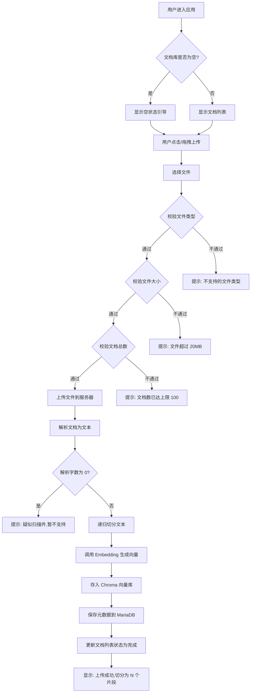
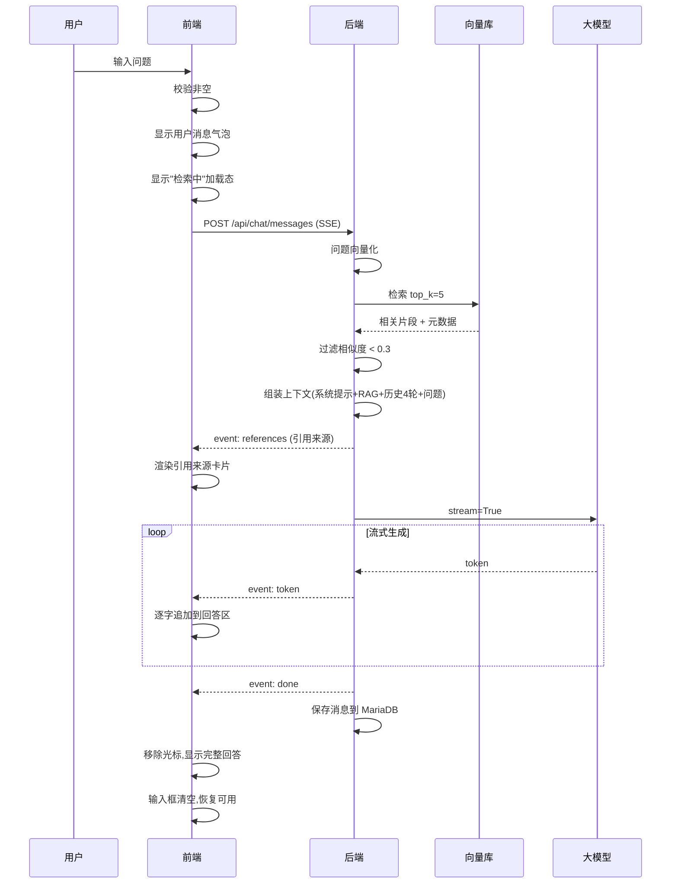
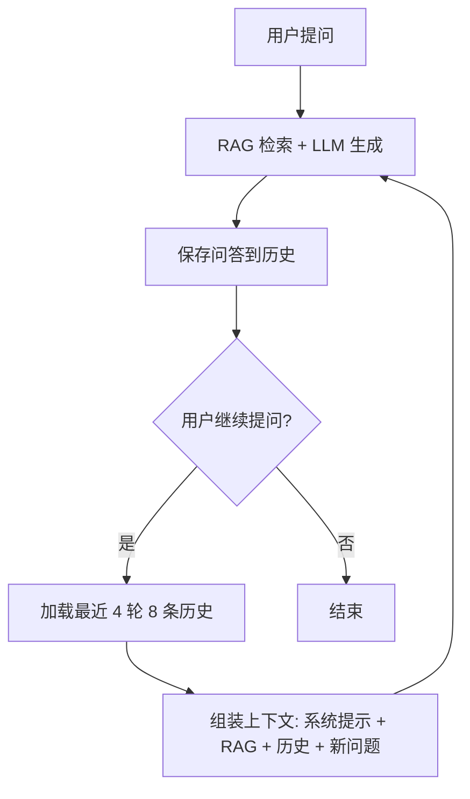
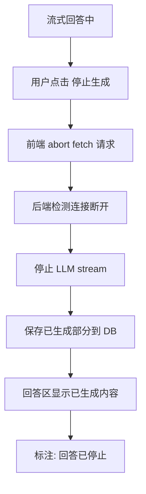
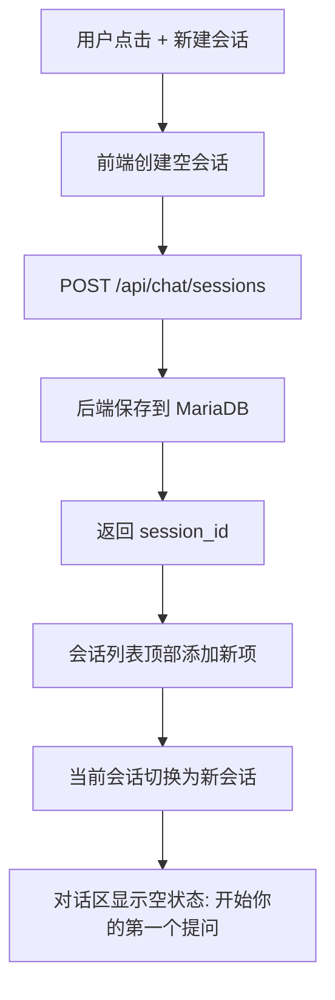
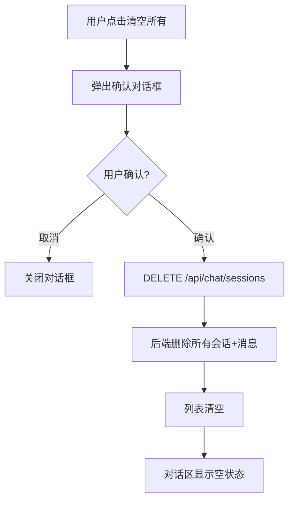
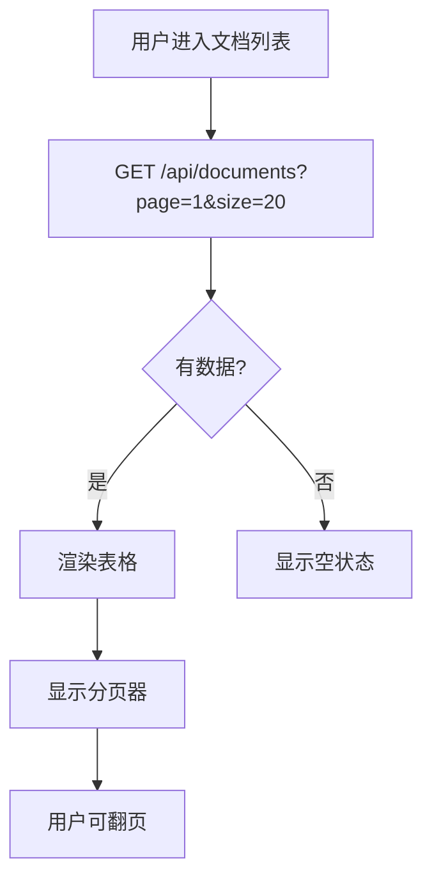
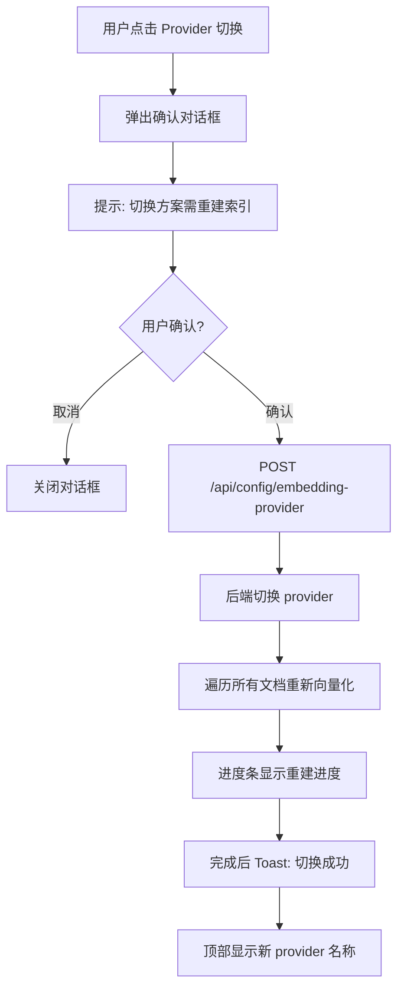
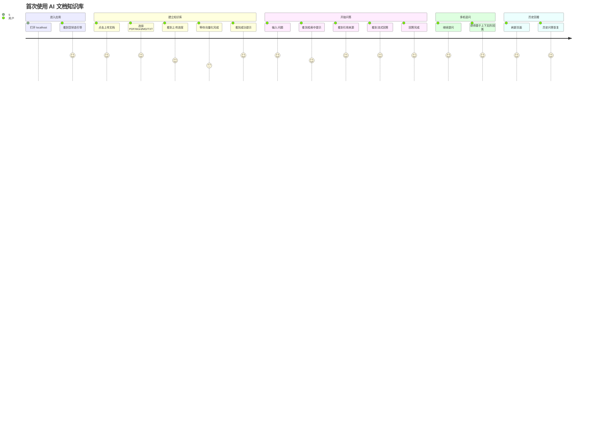
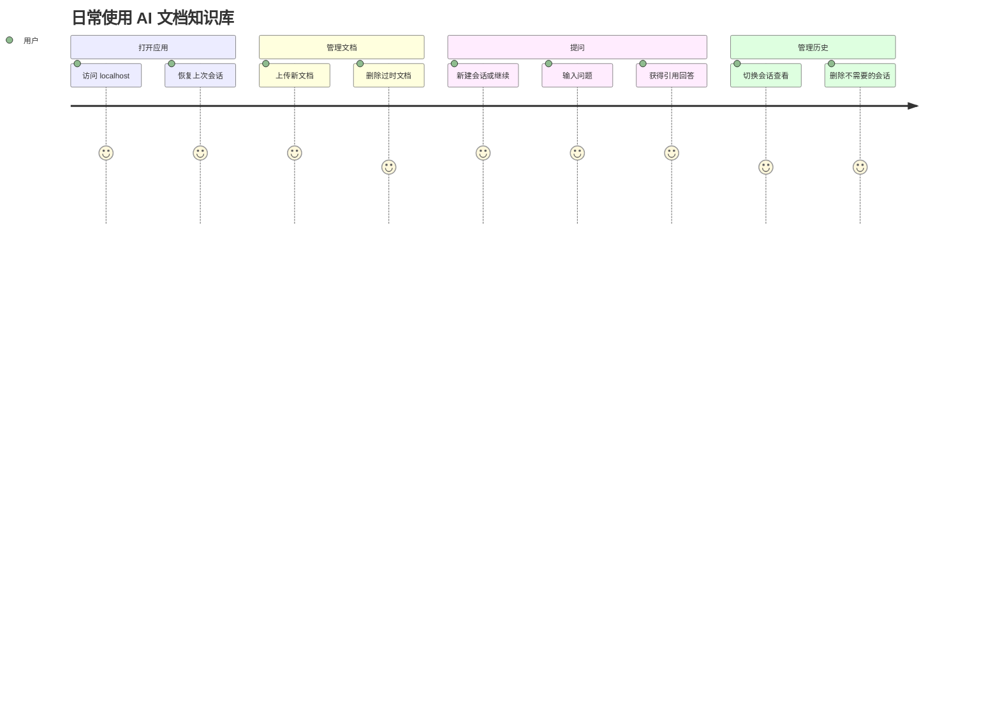

<!--
Document: User Flows
Version: 1.0.0
Author: UI/UX Designer
Created: 2026-07-12
Updated: 2026-07-12
-->

# 用户流程：AI 文档知识库（MVP）

## 文档元信息

| 字段 | 内容 |
|------|------|
| 文档名称 | 用户流程文档 |
| 版本 | 1.0.0 |
| 作者 | UI/UX Designer |
| 创建日期 | 2026-07-12 |
| 状态 | 完成 |
| 关联文档 | `docs/prd.md`、`docs/design-system.md` |

---

## 1. 流程总览

| 流程编号 | 流程名称 | 对应用户故事 | 优先级 |
|----------|----------|--------------|--------|
| UF-001 | 文档上传与向量化 | US-001/002/003/006/007 | P0 |
| UF-002 | RAG 问答（含流式+引用） | US-010/011/012/013/014/015 | P0 |
| UF-003 | 会话管理 | US-016/017/018/019/020 | P0 |
| UF-004 | 文档管理 | US-004/005 | P0 |
| UF-005 | Embedding Provider 切换 | US-008 | P1 |

---

## 2. UF-001: 文档上传与向量化

### 2.1 主流程（Happy Path）



### 2.2 状态流转

| 步骤 | 状态标签 | 视觉反馈 | 预计耗时 |
|------|----------|----------|----------|
| 上传文件 | 上传中（黄色） | 进度条 + "上传中" | 1-5s |
| 解析文档 | 解析中（黄色） | 旋转图标 + "解析中" | 1-3s |
| 文本切分 | 切分中（黄色） | 旋转图标 + "切分中" | < 1s |
| Embedding | 向量化中（黄色） | 旋转图标 + "向量化中" | 2-10s/文件 |
| 存储 | 向量化中（黄色） | 同上 | < 1s |
| 完成 | 完成（绿色） | 绿色标签 | - |

### 2.3 异常流程

| 异常场景 | 触发条件 | 处理方式 | 用户看到 |
|----------|----------|----------|----------|
| 不支持的文件类型 | 扩展名不在 [pdf,docx,md,txt] 内 | 前端拦截 | Toast: "不支持的文件类型，请上传 PDF/Word/Markdown/TXT" |
| 文件过大 | 单文件 > 20MB | 前端拦截 | Toast: "文件超过 20MB 限制" |
| 文档数超限 | 已有 ≥ 100 个文档 | 后端拒绝 | Toast: "文档数已达上限 100，请先删除不需要的文档" |
| 扫描件 PDF | 解析后字数 = 0 | 后端返回特定错误 | 文档列表状态"失败" + 提示"疑似扫描件，MVP 暂不支持 OCR" |
| 解析失败 | PyPDF2/python-docx 异常 | 后端捕获 | 状态"失败" + "文档解析失败，请检查文件是否损坏" |
| Embedding 失败 | OpenAI API 错误/网络超时 | 后端重试 1 次 | 状态"失败" + "向量化失败，请检查 API Key 或网络" + 重试按钮 |
| 网络中断 | 上传中断 | 前端检测 | Toast: "网络中断，请重试" |

### 2.4 批量上传流程


**说明**：批量上传时每个文件独立处理，互不影响。前端显示每个文件的独立状态。后端可并行处理（并发受限于 Embedding API 速率）。

---

## 3. UF-002: RAG 问答

### 3.1 主流程（Happy Path）



### 3.2 交互状态

| 阶段 | 视觉状态 | 用户可操作 |
|------|----------|------------|
| 输入问题 | 输入框聚焦，发送按钮可用 | 输入文字 |
| 发送中 | 用户消息出现，输入框禁用 | 等待 |
| 检索中 | "检索中"加载态（对话区） | 可点击"停止" |
| 引用到达 | 引用卡片渲染（回答上方） | 可展开/折叠引用 |
| 首 token 到达 | 光标闪烁，逐字显示 | 可点击"停止生成" |
| 流式中 | 逐字追加 | 可点击"停止生成" |
| 完成 | 光标消失，回答完整 | 可输入新问题 |
| 错误 | 红色错误提示 + 重试 | 可点击"重试" |

### 3.3 多轮对话流程



**上下文组装顺序**（DEC-011）：
1. 系统提示（~200 token）：定义 AI 角色与回答规范
2. RAG 上下文（top_k=5 × 500 字符）：当前问题检索到的文档片段
3. 历史对话（最近 4 轮 8 条消息）：保持多轮连贯性
4. 当前问题：用户本次提问

**截断规则**：
- 超过 4 轮时，最早的轮次不进入上下文
- Token 总预算 ~6000，超出时优先保留系统提示与 RAG 上下文

### 3.4 异常流程

| 异常场景 | 触发条件 | 处理方式 | 用户看到 |
|----------|----------|----------|----------|
| 空问题 | 输入框为空点发送 | 前端拦截 | 发送按钮禁用 |
| 无相关内容 | 检索结果全部低于阈值 0.3 | 不调用 LLM | 提示卡片："未在文档库中找到相关内容，请尝试换个问题或上传更多文档" |
| LLM 超时 | 调用 > 30s | 后端中断 | event: error → "回答生成超时，请重试" + 重试按钮 |
| LLM 错误 | API Key 无效/额度不足 | 后端捕获 | event: error → "回答生成失败：{原因}" + 重试 |
| 网络中断 | SSE 连接断开 | 前端检测 | "网络中断，已生成的部分内容已保存" |
| 文档库为空提问 | 无文档时提问 | 后端检查 | 提示："知识库为空，请先上传文档" |
| 会话历史加载失败 | DB 查询失败 | 后端降级 | 使用空历史继续（不影响当前问答） |

### 3.5 停止生成流程



---

## 4. UF-003: 会话管理

### 4.1 新建会话



### 4.2 切换会话

```mermaid
flowchart TD
    A[用户点击会话列表项] --> B[GET /api/chat/sessions/{id}/messages]
    B --> C[后端查询历史消息]
    C --> D[返回消息列表]
    D --> E[对话区渲染历史问答]
    E --> F[当前会话高亮]
    F --> G[输入框聚焦,可继续提问]
```

### 4.3 删除会话

```mermaid
flowchart TD
    A[用户点击删除按钮] --> B[弹出确认对话框]
    B --> C{用户确认?}
    C -- 取消 --> D[关闭对话框]
    C -- 确认 --> E[DELETE /api/chat/sessions/{id}]
    E --> F[后端级联删除会话+消息]
    F --> G[列表移除该项]
    G --> H{删除的是当前会话?}
    H -- 是 --> I[切换到第一个会话或空状态]
    H -- 否 --> J[保持当前会话]
```

### 4.4 清空所有会话



### 4.5 历史持久化（刷新恢复）

```mermaid
flowchart TD
    A[用户刷新页面] --> B[前端加载]
    B --> C[GET /api/chat/sessions]
    C --> D[返回会话列表按时间倒序]
    D --> E[默认选中第一个会话]
    E --> F[GET /api/chat/sessions/{id}/messages]
    F --> G[渲染历史消息]
    G --> H[页面恢复到刷新前状态]
```

---

## 5. UF-004: 文档管理

### 5.1 查看文档列表



### 5.2 删除文档

```mermaid
flowchart TD
    A[用户点击删除] --> B[确认对话框]
    B --> C{确认?}
    C -- 取消 --> D[关闭]
    C -- 确认 --> E[DELETE /api/documents/{id}]
    E --> F[后端删除 Chroma 向量]
    E --> G[后端删除 MariaDB 元数据]
    F --> H[返回成功]
    G --> H
    H --> I[列表移除该项]
    I --> J[Toast: 删除成功]
```

---

## 6. UF-005: Embedding Provider 切换

### 6.1 切换流程



### 6.2 异常流程

| 异常场景 | 处理方式 |
|----------|----------|
| 本地模型未下载 | 提示"本地模型未下载，正在下载 2.3GB，请耐心等待" + 下载进度 |
| 重建失败 | 回滚到原 provider + "切换失败，已恢复原方案" |

---

## 7. 完整用户旅程

### 7.1 首次使用旅程



### 7.2 日常使用旅程



---

## 8. 交互状态矩阵

| 页面/组件 | 默认 | 悬停 | 激活 | 禁用 | 加载 | 错误 | 空状态 |
|-----------|------|------|------|------|------|------|--------|
| 上传按钮 | 主色 | 深主色 | 更深 | 灰色 | 旋转 | - | - |
| 发送按钮 | 主色 | 深主色 | 更深 | 灰色(空输入) | - | - | - |
| 停止按钮 | 危险色 | 深红 | 更深 | - | - | - | - |
| 文档列表行 | 白底 | 浅灰底 | - | - | 骨架屏 | 错误标签 | 空状态引导 |
| 会话列表项 | 白底 | 浅灰底 | 主色边条 | - | 骨架屏 | - | 空状态引导 |
| 消息气泡 | 纯色底 | - | - | - | 光标闪烁 | 红色提示 | 引导提问 |
| 引用卡片 | 浅灰底 | 边框加深 | - | - | - | - | 不显示 |
| 输入框 | 灰边框 | 边框加深 | 主色边框+阴影 | 灰底 | - | 红边框 | placeholder |

---

## 9. 检查清单

- [x] 覆盖所有 PRD 核心功能（文档上传/问答/会话/文档管理/Provider 切换）
- [x] 每个流程有主流程（Happy Path）
- [x] 每个流程有异常流程（Error/Edge Cases）
- [x] 定义了空状态处理
- [x] 定义了加载状态
- [x] 定义了错误状态
- [x] 交互状态矩阵完整（8 种状态 × 8 个组件）
- [x] 多轮对话上下文流程清晰
- [x] 流式输出与停止生成流程清晰
- [x] 历史持久化（刷新恢复）流程清晰
- [x] 无占位符/省略号

---

## 附录

### A. 变更历史

| 版本 | 日期 | 变更说明 | 作者 |
|------|------|----------|------|
| 1.0.0 | 2026-07-12 | 初始版本，定义 5 个核心用户流程 | UI/UX Designer |
